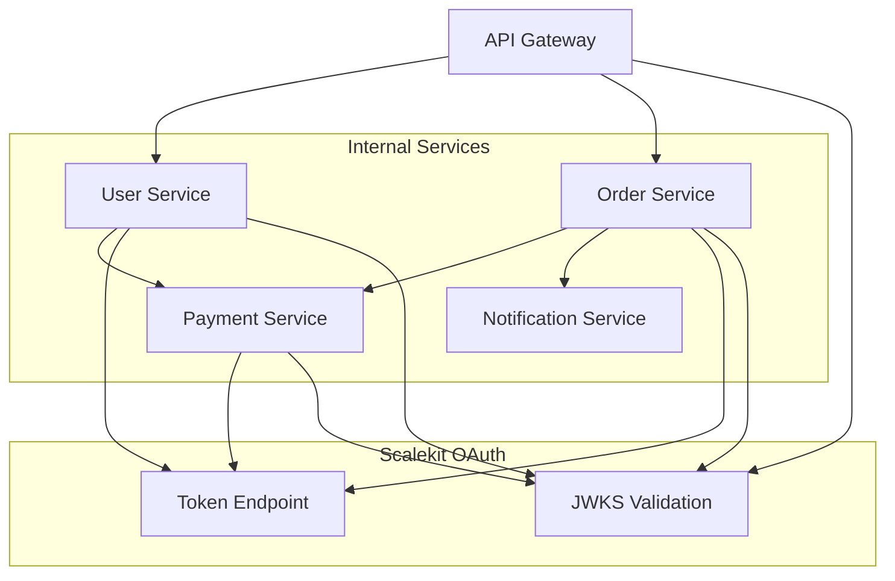
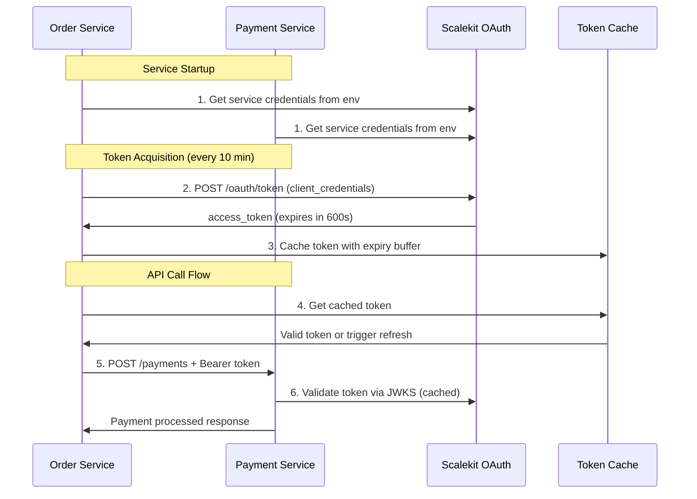

**Secure, high-performance authentication for your internal microservices architecture**

Microservices authentication provides OAuth 2.1 Client Credentials flow optimized for service-to-service communication within your B2B SaaS platform. This enables zero-trust internal architecture with JWT-based authentication that supports thousands of requests per second.

## What is Microservices Authentication?

Microservices authentication replaces API keys and shared secrets with **short-lived JWT tokens** that provide service identity, automatic token rotation, and granular permission controls for internal service communication.

### Real-World Example: E-Commerce Platform

**Your B2B SaaS:** CommerceHub - multi-tenant e-commerce platform  
**Architecture:** API Gateway + User Service + Order Service + Payment Service  
**Challenge:** Secure all internal API calls while maintaining sub-50ms latency



**Flow:**

1. Each service gets unique OAuth credentials during deployment
2. Services request tokens using Client Credentials flow with short expiry (5-15 minutes)
3. Services cache tokens and use them for all internal API calls
4. Receiving services validate tokens via cached JWKS keys
5. Zero-trust: every internal API call is authenticated and authorized

## When Your Platform Needs Microservices Authentication

Replace API keys and shared secrets when you have:

### **Zero-Trust Architecture Requirements**

- ✅ **Service Mesh Security** - Istio, Linkerd, or Consul Connect requiring service identity
- ✅ **Compliance Standards** - SOC2, ISO 27001, or PCI requiring internal authentication
- ✅ **Network Segmentation** - Multi-cloud or hybrid deployments with untrusted networks

### **High-Performance Internal APIs**

- ✅ **API Gateway Patterns** - Gateway authenticating every request to backend services
- ✅ **Event-Driven Architecture** - Message queues and event processing with secure service access
- ✅ **Real-Time Services** - WebSocket services, streaming APIs, or live data processing

### **Service Identity and Authorization**

- ✅ **Per-Service Permissions** - Different services need different access levels
- ✅ **Audit Requirements** - Track which services access what data and when
- ✅ **Dynamic Scaling** - Auto-scaling services that need instant authentication

## Implementation Overview



---

## Step 1: Configure Service Credentials

### Service Registration and Credential Generation

```javascript
// DevOps script to create service credentials
import { ScalekitM2MClient } from '@scalekit/node-sdk';

const createServiceCredentials = async (serviceName, environment, permissions) => {
  const scalekit = new ScalekitM2MClient(scalekitEnv, adminApiKey);
  
  const serviceClient = await scalekit.createOrganizationClient(
    'internal-services', // Special organization for internal services
    {
      name: `${serviceName}-${environment}`,
      description: `Service credentials for ${serviceName} in ${environment}`,
      scopes: permissions,
      audience: [`api.${environment}.yourplatform.com`],
      expiry: 600, // 10 minutes - short-lived for security
      custom_claims: [
        { key: "service_name", value: serviceName },
        { key: "environment", value: environment },
        { key: "service_type", value: "microservice" }
      ]
    }
  );

  return {
    service_name: serviceName,
    client_id: serviceClient.client.client_id,
    client_secret: serviceClient.plain_secret,
    permissions: permissions,
    token_endpoint: `https://${scalekitEnv}.scalekit.com/oauth/token`,
    jwks_uri: `https://${scalekitEnv}.scalekit.com/.well-known/jwks`
  };
};

// Create credentials for each service
const services = [
  { name: 'user-service', permissions: ['read:users', 'write:users', 'read:organizations'] },
  { name: 'order-service', permissions: ['read:orders', 'write:orders', 'call:payment-service'] },
  { name: 'payment-service', permissions: ['read:payments', 'write:payments'] }
];

for (const service of services) {
  const credentials = await createServiceCredentials(service.name, 'production', service.permissions);
  await storeServiceCredentials(service.name, credentials);
}
```

### Kubernetes Deployment Configuration

```yaml
# kubernetes/order-service-deployment.yaml
apiVersion: apps/v1
kind: Deployment
metadata:
  name: order-service
spec:
  replicas: 3
  selector:
    matchLabels:
      app: order-service
  template:
    metadata:
      labels:
        app: order-service
    spec:
      containers:
      - name: order-service
        image: your-registry/order-service:latest
        env:
        - name: OAUTH_CLIENT_ID
          valueFrom:
            secretKeyRef:
              name: order-service-oauth
              key: client-id
        - name: OAUTH_CLIENT_SECRET
          valueFrom:
            secretKeyRef:
              name: order-service-oauth
              key: client-secret
        - name: OAUTH_TOKEN_URL
          value: "https://your-env.scalekit.com/oauth/token"
        - name: OAUTH_JWKS_URI
          value: "https://your-env.scalekit.com/.well-known/jwks"
---
apiVersion: v1
kind: Secret
metadata:
  name: order-service-oauth
type: Opaque
data:
  client-id: <base64-encoded-client-id>
  client-secret: <base64-encoded-client-secret>
```

---

## Step 2: Implement Service Authentication Client

### High-Performance Token Management

```javascript
// Service authentication client with automatic token refresh
class ServiceAuthClient {
  constructor(config) {
    this.clientId = config.clientId;
    this.clientSecret = config.clientSecret;
    this.tokenUrl = config.tokenUrl;
    this.serviceName = config.serviceName;
    this.audience = config.audience;
    
    this.tokenCache = { token: null, expiresAt: 0 };
    this.startTokenRefresh();
  }

  async getAccessToken() {
    const now = Date.now();
    const bufferTime = 60 * 1000; // 1 minute buffer
    
    if (this.tokenCache.token && this.tokenCache.expiresAt > now + bufferTime) {
      return this.tokenCache.token;
    }
    
    return await this.refreshToken();
  }

  async refreshToken() {
    const response = await fetch(this.tokenUrl, {
      method: 'POST',
      headers: { 'Content-Type': 'application/x-www-form-urlencoded' },
      body: new URLSearchParams({
        grant_type: 'client_credentials',
        client_id: this.clientId,
        client_secret: this.clientSecret,
        audience: this.audience
      })
    });

    if (!response.ok) {
      throw new Error(`Token refresh failed: ${response.statusText}`);
    }

    const tokenData = await response.json();
    this.tokenCache.token = tokenData.access_token;
    this.tokenCache.expiresAt = Date.now() + (tokenData.expires_in * 1000);
    
    return tokenData.access_token;
  }

  startTokenRefresh() {
    // Refresh token every 8 minutes (for 10-minute tokens)
    setInterval(async () => {
      try {
        await this.refreshToken();
      } catch (error) {
        console.error(`Token refresh failed:`, error);
      }
    }, 8 * 60 * 1000);
  }

  async makeAuthenticatedRequest(url, options = {}) {
    const token = await this.getAccessToken();
    
    return fetch(url, {
      ...options,
      headers: {
        'Authorization': `Bearer ${token}`,
        'Content-Type': 'application/json',
        'X-Service-Name': this.serviceName,
        ...options.headers
      }
    });
  }
}

// Usage in a service
class OrderService {
  constructor() {
    this.auth = new ServiceAuthClient({
      clientId: process.env.OAUTH_CLIENT_ID,
      clientSecret: process.env.OAUTH_CLIENT_SECRET,
      tokenUrl: process.env.OAUTH_TOKEN_URL,
      serviceName: 'order-service',
      audience: 'api.yourplatform.com'
    });
    
    this.paymentServiceUrl = process.env.PAYMENT_SERVICE_URL;
  }

  async processPayment(orderId, paymentData) {
    const response = await this.auth.makeAuthenticatedRequest(
      `${this.paymentServiceUrl}/payments`,
      {
        method: 'POST',
        body: JSON.stringify({ order_id: orderId, ...paymentData })
      }
    );

    if (!response.ok) {
      throw new Error(`Payment service error: ${response.statusText}`);
    }

    return await response.json();
  }
}
```

---

## Step 3: Implement Token Validation

### High-Performance Token Validation

```javascript
// Optimized token validation with caching
import jwt from 'jsonwebtoken';
import jwksClient from 'jwks-rsa';
import NodeCache from 'node-cache';

class TokenValidator {
  constructor(jwksUri, audience) {
    this.audience = audience;
    
    this.jwksClient = jwksClient({
      jwksUri: jwksUri,
      cache: true,
      cacheMaxAge: 600000, // 10 minutes
      rateLimit: true
    });
    
    // Cache validated tokens for 5 minutes
    this.tokenCache = new NodeCache({ stdTTL: 300, maxKeys: 10000 });
  }

  async validateToken(token) {
    // Check cache first
    const cacheKey = token.split('.')[2]; // Use signature as key
    const cachedResult = this.tokenCache.get(cacheKey);
    if (cachedResult) return cachedResult;
    
    // Validate JWT
    const decoded = await new Promise((resolve, reject) => {
      jwt.verify(token, this.getSigningKey.bind(this), {
        algorithms: ['RS256'],
        audience: this.audience,
        issuer: 'https://your-env.scalekit.com'
      }, (err, decoded) => {
        if (err) reject(err);
        else resolve(decoded);
      });
    });
    
    const result = {
      service_name: decoded.custom_claims?.service_name,
      scopes: decoded.scopes || [],
      client_id: decoded.client_id,
      expires_at: decoded.exp
    };
    
    // Cache result
    const ttl = Math.min(decoded.exp - Math.floor(Date.now() / 1000), 300);
    this.tokenCache.set(cacheKey, result, ttl);
    
    return result;
  }

  getSigningKey(header, callback) {
    this.jwksClient.getSigningKey(header.kid, (err, key) => {
      if (err) return callback(err);
      callback(null, key.getPublicKey());
    });
  }
}

// Express middleware
const createTokenValidationMiddleware = (jwksUri, audience) => {
  const validator = new TokenValidator(jwksUri, audience);
  
  return async (req, res, next) => {
    const authHeader = req.headers.authorization;
    
    if (!authHeader || !authHeader.startsWith('Bearer ')) {
      return res.status(401).json({ error: 'Bearer token required' });
    }

    try {
      const token = authHeader.substring(7);
      const validation = await validator.validateToken(token);
      req.serviceAuth = validation;
      next();
    } catch (error) {
      return res.status(401).json({ error: 'Invalid token' });
    }
  };
};

// Usage in service
const app = express();
const validateServiceToken = createTokenValidationMiddleware(
  process.env.OAUTH_JWKS_URI,
  process.env.API_AUDIENCE
);

app.use('/api/internal', validateServiceToken);

app.post('/api/internal/payments', requireScope(['write:payments']), (req, res) => {
  console.log(`Payment request from: ${req.serviceAuth.service_name}`);
  res.json({ payment_id: 'pay_123', status: 'processed' });
});

function requireScope(requiredScopes) {
  return (req, res, next) => {
    const hasScope = requiredScopes.some(scope => 
      req.serviceAuth.scopes.includes(scope)
    );
    
    if (!hasScope) {
      return res.status(403).json({ error: 'Insufficient scope' });
    }
    next();
  };
}
```

---

## Step 4: Service Mesh Integration

### Istio Configuration

```yaml
# Istio authentication policy for JWT validation
apiVersion: security.istio.io/v1beta1
kind: RequestAuthentication
metadata:
  name: jwt-auth
  namespace: production
spec:
  selector:
    matchLabels:
      app: internal-service
  jwtRules:
  - issuer: "https://your-env.scalekit.com"
    jwksUri: "https://your-env.scalekit.com/.well-known/jwks"
    audiences: ["api.production.yourplatform.com"]
---
# Authorization policy for service-to-service calls
apiVersion: security.istio.io/v1beta1
kind: AuthorizationPolicy
metadata:
  name: service-access-control
  namespace: production
spec:
  selector:
    matchLabels:
      app: payment-service
  rules:
  - when:
    - key: request.auth.claims[custom_claims.service_name]
      values: ["order-service"]
    - key: request.auth.claims[scopes]
      values: ["call:payment-service"]
```

### API Gateway with Service Authentication

```javascript
// Simple API Gateway with service token validation
import express from 'express';
import httpProxy from 'http-proxy-middleware';

class APIGateway {
  constructor() {
    this.app = express();
    this.tokenValidator = new TokenValidator(
      process.env.OAUTH_JWKS_URI,
      process.env.API_AUDIENCE
    );
    this.setupRoutes();
  }

  setupRoutes() {
    this.app.use('/api/users', this.createServiceProxy('user-service'));
    this.app.use('/api/orders', this.createServiceProxy('order-service'));
    this.app.use('/api/payments', this.createServiceProxy('payment-service'));
  }

  createServiceProxy(serviceName) {
    return httpProxy({
      target: `http://${serviceName}:8080`,
      changeOrigin: true,
      pathRewrite: { '^/api/': '/api/internal/' },
      onProxyReq: async (proxyReq, req, res) => {
        try {
          const authHeader = req.headers.authorization;
          if (!authHeader) {
            res.status(401).json({ error: 'Authorization required' });
            return;
          }

          const token = authHeader.replace('Bearer ', '');
          const validation = await this.tokenValidator.validateToken(token);
          
          // Add service context headers
          proxyReq.setHeader('X-Service-Name', validation.service_name);
          proxyReq.setHeader('X-Service-Scopes', validation.scopes.join(','));
          
        } catch (error) {
          res.status(401).json({ error: 'Invalid token' });
        }
      }
    });
  }
}

new APIGateway().app.listen(3000);
```

---

## Common Implementation Patterns

### Pattern 1: Event-Driven Services

```javascript
// Service that processes events with authentication
class EventProcessor {
  constructor() {
    this.auth = new ServiceAuthClient({
      clientId: process.env.OAUTH_CLIENT_ID,
      clientSecret: process.env.OAUTH_CLIENT_SECRET,
      tokenUrl: process.env.OAUTH_TOKEN_URL,
      serviceName: 'event-processor',
      audience: process.env.API_AUDIENCE
    });
  }

  async processOrderEvent(orderData) {
    // Call user service to get customer info
    const userResponse = await this.auth.makeAuthenticatedRequest(
      `${process.env.USER_SERVICE_URL}/users/${orderData.user_id}`
    );
    
    if (!userResponse.ok) {
      throw new Error('Failed to fetch user data');
    }
    
    const user = await userResponse.json();
    
    // Process the order with user context
    console.log(`Processing order for ${user.email}`);
    return { processed: true, user_id: user.id };
  }
}
```

### Pattern 2: Background Job Services

```javascript
// Background service that needs to call multiple APIs
class ReportGenerator {
  constructor() {
    this.auth = new ServiceAuthClient({
      clientId: process.env.OAUTH_CLIENT_ID,
      clientSecret: process.env.OAUTH_CLIENT_SECRET,
      tokenUrl: process.env.OAUTH_TOKEN_URL,
      serviceName: 'report-generator',
      audience: process.env.API_AUDIENCE
    });
  }

  async generateDailyReport(organizationId) {
    // Fetch data from multiple services
    const [orders, payments, users] = await Promise.all([
      this.fetchOrders(organizationId),
      this.fetchPayments(organizationId),
      this.fetchUsers(organizationId)
    ]);
    
    return this.compileReport({ orders, payments, users });
  }

  async fetchOrders(orgId) {
    const response = await this.auth.makeAuthenticatedRequest(
      `${process.env.ORDER_SERVICE_URL}/orders?org_id=${orgId}`
    );
    return response.json();
  }

  async fetchPayments(orgId) {
    const response = await this.auth.makeAuthenticatedRequest(
      `${process.env.PAYMENT_SERVICE_URL}/payments?org_id=${orgId}`
    );
    return response.json();
  }
}
```

---

## Security Best Practices

### 1. Token Rotation and Caching

- **Short-lived tokens** (5-15 minutes) with automatic refresh
- **Token caching** with proper expiry buffering
- **Background refresh** to avoid request delays
- **Graceful fallback** when token refresh fails

### 2. Service Scope Design

```javascript
// Example service-specific scopes
const SERVICE_SCOPES = {
  'user-service': ['read:users', 'write:users', 'read:organizations'],
  'order-service': ['read:orders', 'write:orders', 'call:payment-service', 'call:user-service'],
  'payment-service': ['read:payments', 'write:payments'],
  'api-gateway': ['gateway:user-service', 'gateway:order-service', 'gateway:payment-service']
};
```

### 3. Network Security

- **mTLS** for service mesh communication
- **Network policies** restricting service-to-service communication
- **Service discovery** with authentication
- **Load balancer** health checks without authentication

---

## Performance Considerations

### Token Validation Optimization

- **JWKS caching** (10 minutes) to minimize external calls
- **Token result caching** (5 minutes) for frequently accessed tokens
- **Connection pooling** for HTTP clients
- **Circuit breakers** for token endpoint failures

### Monitoring Key Metrics

- **Token validation latency** (target: <10ms)
- **Cache hit rates** (target: >90%)
- **Service-to-service call success rates**
- **Token refresh frequency and failures**

---

## Troubleshooting

### Common Issues

**Token Validation Failures**

```bash
# Check JWKS endpoint accessibility
curl https://your-env.scalekit.com/.well-known/jwks

# Verify token claims
echo "JWT_TOKEN" | base64 -d | jq .
```

**Service Authentication Issues**

```javascript
// Debug token acquisition
const debugAuth = async () => {
  try {
    const token = await serviceAuth.getAccessToken();
    const decoded = jwt.decode(token);
    console.log('Token claims:', decoded);
  } catch (error) {
    console.error('Auth debug failed:', error);
  }
};
```

**High Latency Issues**

- Check JWKS cache configuration
- Monitor token validation metrics
- Verify network connectivity between services
- Review token cache hit rates

---

## Next Steps

✅ **Microservices Authentication Implemented!** Your services now communicate securely with OAuth 2.1.

**What's Next:**

1. **[Token Verification](/guides/m2m/token-verification/)** - Advanced validation patterns
2. **[Service Principals](/guides/m2m/service-principals/)** - Enable customer API access
3. **[Third-Party Apps](/guides/m2m/user-delegated-access/)** - Build developer ecosystem

**For Your Infrastructure:**

- Set up service credential rotation policies
- Implement comprehensive monitoring and alerting
- Configure service mesh security policies
- Establish incident response procedures
