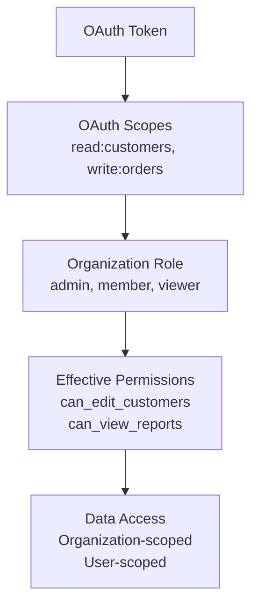

**Design and implement fine-grained authorization for your B2B SaaS APIs**

Scopes and permissions control what authenticated clients can access in your APIs. While token verification ensures "who you are," scopes and permissions enforce "what you can do" based on OAuth scopes, user roles, and organizational context.

## What are Scopes and Permissions?

**OAuth Scopes** define the broad categories of access that tokens can have (e.g., `read:users`, `write:orders`).

**Permissions** are the specific actions that can be performed within those scopes, often combined with organizational roles and context.

### B2B SaaS Authorization Hierarchy



**Example Authorization Flow:**

1. Service Principal has scope `read:customers`
2. Organization admin grants "manager" role to the Service Principal
3. Effective permission: Can read all customers in the organization
4. Data scoping: Returns only customers belonging to that organization

## When You Need Scopes and Permissions

Implement authorization when you have:

### **Multi-Level Access Requirements**

- ✅ **Different user roles** (admin, manager, viewer) with varying permissions
- ✅ **Service-specific access** (reporting service vs. integration service)
- ✅ **Feature-based permissions** (basic vs. premium feature access)
- ✅ **Resource-specific access** (read orders but not payments)

### **Compliance and Security**

- ✅ **Principle of least privilege** - Grant minimum necessary access
- ✅ **Audit requirements** - Track what actions users can perform
- ✅ **Data classification** - Control access to sensitive information
- ✅ **Regulatory compliance** - Meet industry-specific access controls

### **Platform Growth**

- ✅ **Third-party integrations** - Control what external apps can access
- ✅ **API monetization** - Different permission tiers for different pricing
- ✅ **Partner access** - Limited access for integration partners

---

## Scope Design Patterns

### Pattern 1: Resource-Action Scopes

Most common pattern for B2B SaaS APIs, using format: `action:resource`

```javascript
// Example scope hierarchy for a CRM platform
const CRM_SCOPES = {
  // Customer management
  'read:customers': 'View customer information',
  'write:customers': 'Create and update customers',
  'delete:customers': 'Delete customer records',
  
  // Contact management
  'read:contacts': 'View contacts and communication history',
  'write:contacts': 'Manage contacts and interactions',
  
  // Sales and revenue
  'read:deals': 'View sales opportunities',
  'write:deals': 'Manage sales pipeline',
  'read:revenue': 'Access revenue and financial data',
  
  // Reporting and analytics
  'read:reports': 'Generate and view reports',
  'read:analytics': 'Access usage and performance metrics',
  
  // Administration
  'admin:organization': 'Manage organization settings',
  'admin:users': 'Manage organization users and roles'
};
```

### Pattern 2: Service-Specific Scopes

For microservices architecture, scopes can represent service access:

```javascript
// Service access scopes
const SERVICE_SCOPES = {
  'call:user-service': 'Make API calls to user service',
  'call:payment-service': 'Access payment processing APIs',
  'call:notification-service': 'Send notifications',
  'gateway:all-services': 'API gateway access to all services'
};
```

### Pattern 3: Hierarchical Scopes

Some platforms use hierarchical scopes for granular control:

```javascript
// Hierarchical scope structure
const HIERARCHICAL_SCOPES = {
  'customers': 'Full customer access (implies customers:read, customers:write)',
  'customers:read': 'Read customer data',
  'customers:write': 'Write customer data (implies customers:read)',
  'customers:export': 'Export customer data (implies customers:read)',
  'customers:delete': 'Delete customers (implies customers:read, customers:write)'
};
```

---

## Step 1: Design Your Scope Structure

### Scope Categories by Use Case

```javascript
// Organize scopes by functional areas
const SCOPE_CATEGORIES = {
  // Core data access
  data_access: {
    'read:customers': 'View customer information',
    'write:customers': 'Create and update customer records',
    'read:orders': 'View order information',
    'write:orders': 'Create and update orders',
    'read:products': 'View product catalog'
  },
  
  // Reporting and analytics
  reporting: {
    'read:reports': 'Generate and access standard reports',
    'read:analytics': 'Access usage and performance data',
    'export:data': 'Export data for external analysis'
  },
  
  // Administration
  administration: {
    'admin:organization': 'Manage organization settings',
    'admin:users': 'Manage user accounts and permissions',
    'admin:billing': 'Access billing and subscription data'
  },
  
  // Integration capabilities
  integration: {
    'webhook:receive': 'Receive webhook notifications',
    'api:rate-limit-extended': 'Higher API rate limits',
    'sync:real-time': 'Real-time data synchronization'
  }
};

// Scope templates for common use cases
const SCOPE_TEMPLATES = {
  'basic_reporting': ['read:customers', 'read:orders', 'read:reports'],
  'bi_integration': ['read:customers', 'read:orders', 'read:analytics', 'export:data'],
  'order_management': ['read:orders', 'write:orders', 'read:customers'],
  'full_admin': ['admin:organization', 'admin:users', 'admin:billing']
};
```

### Scope Validation Rules

```javascript
// Define scope relationships and validation
class ScopeValidator {
  constructor() {
    // Scopes that imply other scopes
    this.implications = {
      'write:customers': ['read:customers'],
      'delete:customers': ['read:customers', 'write:customers'],
      'admin:organization': ['read:users', 'read:organization']
    };
    
    // Mutually exclusive scopes
    this.conflicts = [
      ['read-only:all', 'write:customers'],
      ['basic:access', 'admin:organization']
    ];
  }
  
  validateScopes(requestedScopes) {
    // Add implied scopes
    const expandedScopes = this.expandScopes(requestedScopes);
    
    // Check for conflicts
    const conflicts = this.findConflicts(expandedScopes);
    if (conflicts.length > 0) {
      throw new Error(`Conflicting scopes: ${conflicts.join(', ')}`);
    }
    
    return expandedScopes;
  }
  
  expandScopes(scopes) {
    const expanded = new Set(scopes);
    
    scopes.forEach(scope => {
      const implied = this.implications[scope] || [];
      implied.forEach(impliedScope => expanded.add(impliedScope));
    });
    
    return Array.from(expanded);
  }
}
```

---

## Step 2: Implement Authorization Middleware

### Scope-Based Authorization

```javascript
// Middleware to check OAuth scopes
const requireScope = (requiredScopes) => {
  return (req, res, next) => {
    const tokenScopes = req.auth?.scopes || [];
    
    // Check if user has at least one required scope
    const hasRequiredScope = requiredScopes.some(scope => 
      tokenScopes.includes(scope)
    );
    
    if (!hasRequiredScope) {
      return res.status(403).json({
        error: 'insufficient_scope',
        message: `Required scopes: ${requiredScopes.join(', ')}`,
        available_scopes: tokenScopes
      });
    }
    
    next();
  };
};

// Multiple scope validation strategies
const requireAllScopes = (requiredScopes) => {
  return (req, res, next) => {
    const tokenScopes = req.auth?.scopes || [];
    const hasAllScopes = requiredScopes.every(scope => 
      tokenScopes.includes(scope)
    );
    
    if (!hasAllScopes) {
      const missingScopes = requiredScopes.filter(scope => 
        !tokenScopes.includes(scope)
      );
      
      return res.status(403).json({
        error: 'insufficient_scope',
        message: `Missing required scopes: ${missingScopes.join(', ')}`
      });
    }
    
    next();
  };
};

// Usage in API routes
app.get('/api/customers', 
  validateToken,
  requireScope(['read:customers']),
  getCustomers
);

app.post('/api/customers',
  validateToken,
  requireScope(['write:customers']),
  createCustomer
);

app.delete('/api/customers/:id',
  validateToken,
  requireAllScopes(['delete:customers', 'admin:organization']),
  deleteCustomer
);
```

### Role-Based Authorization

```javascript
// Combine OAuth scopes with organizational roles
const requireRole = (requiredRoles) => {
  return async (req, res, next) => {
    try {
      // Get user's role in the organization
      const userRole = await getUserRoleInOrganization(
        req.auth.userId, 
        req.auth.organizationId
      );
      
      if (!requiredRoles.includes(userRole)) {
        return res.status(403).json({
          error: 'insufficient_role',
          message: `Required role: ${requiredRoles.join(' or ')}`,
          current_role: userRole
        });
      }
      
      req.auth.role = userRole;
      next();
    } catch (error) {
      return res.status(500).json({ error: 'Role validation failed' });
    }
  };
};

// Combined scope and role authorization
const requireScopeAndRole = (scopes, roles) => {
  return [
    requireScope(scopes),
    requireRole(roles)
  ];
};

// Usage
app.get('/api/admin/users',
  validateToken,
  ...requireScopeAndRole(['admin:users'], ['admin', 'owner']),
  getOrganizationUsers
);
```

---

## Step 3: Context-Aware Permissions

### Dynamic Permissions Based on Context

```javascript
// Permission engine that considers multiple factors
class PermissionEngine {
  constructor() {
    this.rules = new Map();
  }
  
  addRule(permission, evaluator) {
    this.rules.set(permission, evaluator);
  }
  
  async checkPermission(permission, context) {
    const evaluator = this.rules.get(permission);
    if (!evaluator) return false;
    
    return await evaluator(context);
  }
}

// Define permission rules
const permissions = new PermissionEngine();

permissions.addRule('can_view_customer', (context) => {
  const { scopes, organizationId, resourceOrganizationId } = context;
  
  // Must have read scope
  if (!scopes.includes('read:customers')) return false;
  
  // Must be same organization
  if (organizationId !== resourceOrganizationId) return false;
  
  return true;
});

permissions.addRule('can_delete_order', async (context) => {
  const { scopes, userId, organizationId, orderId } = context;
  
  // Must have delete scope
  if (!scopes.includes('delete:orders')) return false;
  
  // Check if order belongs to organization
  const order = await getOrder(orderId);
  if (order.organization_id !== organizationId) return false;
  
  // Admin can delete any order, others only their own
  const userRole = await getUserRole(userId, organizationId);
  if (userRole === 'admin') return true;
  
  return order.created_by === userId;
});

// Middleware using permission engine
const requirePermission = (permission) => {
  return async (req, res, next) => {
    const context = {
      scopes: req.auth.scopes,
      userId: req.auth.userId,
      organizationId: req.auth.organizationId,
      resourceId: req.params.id,
      ...req.body
    };
    
    const hasPermission = await permissions.checkPermission(permission, context);
    
    if (!hasPermission) {
      return res.status(403).json({
        error: 'insufficient_permission',
        message: `Permission denied: ${permission}`
      });
    }
    
    next();
  };
};

// Usage
app.delete('/api/orders/:id',
  validateToken,
  requirePermission('can_delete_order'),
  deleteOrder
);
```

### Resource-Level Authorization

```javascript
// Check permissions against specific resources
const authorizeResource = (resourceType, action) => {
  return async (req, res, next) => {
    try {
      const resourceId = req.params.id;
      const resource = await getResource(resourceType, resourceId);
      
      if (!resource) {
        return res.status(404).json({ error: 'Resource not found' });
      }
      
      // Organization-level check
      if (resource.organization_id !== req.auth.organizationId) {
        return res.status(403).json({ error: 'Access denied' });
      }
      
      // User-level check for user-owned resources
      if (resource.user_id && resource.user_id !== req.auth.userId) {
        const userRole = await getUserRole(req.auth.userId, req.auth.organizationId);
        if (!['admin', 'manager'].includes(userRole)) {
          return res.status(403).json({ error: 'Access denied' });
        }
      }
      
      req.resource = resource;
      next();
    } catch (error) {
      return res.status(500).json({ error: 'Authorization check failed' });
    }
  };
};

// Usage
app.get('/api/projects/:id',
  validateToken,
  requireScope(['read:projects']),
  authorizeResource('project', 'read'),
  getProject
);
```

---

## Step 4: Advanced Authorization Patterns

### Conditional Permissions

```javascript
// Time-based and condition-based permissions
const conditionalPermissions = {
  'read:financial_reports': (context) => {
    // Only during business hours for non-admins
    if (context.role === 'admin') return true;
    
    const now = new Date();
    const hour = now.getHours();
    return hour >= 9 && hour <= 17; // 9 AM to 5 PM
  },
  
  'write:critical_data': (context) => {
    // Require MFA for critical operations
    return context.mfaVerified === true;
  },
  
  'export:customer_data': (context) => {
    // Rate limit data exports
    return context.exportsThisMonth < 10;
  }
};
```

### Feature Flags and Permission Gates

```javascript
// Integrate with feature flags for permission gating
const checkFeaturePermission = (featureFlag) => {
  return async (req, res, next) => {
    const orgFeatures = await getOrganizationFeatures(req.auth.organizationId);
    
    if (!orgFeatures.includes(featureFlag)) {
      return res.status(403).json({
        error: 'feature_not_available',
        message: `Feature '${featureFlag}' not available for your organization`
      });
    }
    
    next();
  };
};

// Usage
app.get('/api/advanced-analytics',
  validateToken,
  requireScope(['read:analytics']),
  checkFeaturePermission('advanced_analytics'),
  getAdvancedAnalytics
);
```

---

## Testing Authorization

### Permission Testing Strategies

```javascript
// Test authorization rules
describe('Authorization', () => {
  it('should allow read access with correct scope', async () => {
    const req = mockRequest({
      auth: { scopes: ['read:customers'], organizationId: 'org_123' }
    });
    
    const middleware = requireScope(['read:customers']);
    await expect(middleware(req, mockResponse(), mockNext())).resolves.not.toThrow();
  });
  
  it('should deny access without required scope', async () => {
    const req = mockRequest({
      auth: { scopes: ['read:orders'], organizationId: 'org_123' }
    });
    
    const res = mockResponse();
    const middleware = requireScope(['read:customers']);
    
    await middleware(req, res, mockNext());
    expect(res.status).toHaveBeenCalledWith(403);
  });
  
  it('should enforce organization boundaries', async () => {
    const req = mockRequest({
      auth: { scopes: ['read:customers'], organizationId: 'org_123' },
      params: { id: 'customer_from_org_456' }
    });
    
    const res = mockResponse();
    const middleware = authorizeResource('customer', 'read');
    
    await middleware(req, res, mockNext());
    expect(res.status).toHaveBeenCalledWith(403);
  });
});
```

---

## Best Practices

### Scope Granularity

- **Start broad, refine later** - Begin with coarse-grained scopes, add granularity as needed
- **Follow principle of least privilege** - Grant minimum necessary permissions
- **Group related permissions** - Use scope categories for easier management
- **Version your scopes** - Plan for scope evolution and backward compatibility

### Performance Considerations

```javascript
// Cache permission checks to avoid repeated database queries
const permissionCache = new Map();

const getCachedPermission = async (userId, organizationId, permission) => {
  const cacheKey = `${userId}:${organizationId}:${permission}`;
  
  if (permissionCache.has(cacheKey)) {
    return permissionCache.get(cacheKey);
  }
  
  const hasPermission = await checkUserPermission(userId, organizationId, permission);
  
  // Cache for 5 minutes
  permissionCache.set(cacheKey, hasPermission);
  setTimeout(() => permissionCache.delete(cacheKey), 5 * 60 * 1000);
  
  return hasPermission;
};
```

### Audit and Monitoring

```javascript
// Log authorization decisions for audit trails
const logAuthorizationDecision = (decision, context) => {
  console.log(JSON.stringify({
    timestamp: new Date().toISOString(),
    event: 'authorization_decision',
    decision: decision, // 'granted' or 'denied'
    user_id: context.userId,
    organization_id: context.organizationId,
    scopes: context.scopes,
    resource: context.resource,
    action: context.action,
    ip_address: context.ipAddress
  }));
};
```

---

## Common Authorization Patterns

### Multi-Tenant SaaS Pattern

```javascript
// Standard B2B SaaS authorization flow
const b2bAuthFlow = [
  validateToken,                    // Verify JWT token
  enforceOrganizationScope,        // Ensure organization context
  requireScope(['read:customers']), // Check OAuth scope
  requireRole(['member']),          // Check organizational role
  authorizeResource('customer'),    // Check resource ownership
  logAuthorizationDecision         // Audit log
];

app.get('/api/customers/:id', ...b2bAuthFlow, getCustomer);
```

### API Gateway Pattern

```javascript
// Centralized authorization for microservices
const gatewayAuthz = async (req, res, next) => {
  // Extract service and action from path
  const [, service, action] = req.path.split('/');
  const requiredScope = `${action}:${service}`;
  
  // Check if token has required scope
  if (!req.auth.scopes.includes(requiredScope)) {
    return res.status(403).json({ error: 'Insufficient scope' });
  }
  
  // Add authorization headers for downstream services
  req.headers['x-user-id'] = req.auth.userId;
  req.headers['x-organization-id'] = req.auth.organizationId;
  req.headers['x-user-scopes'] = req.auth.scopes.join(',');
  
  next();
};
```

---

## Next Steps

✅ **Scopes & Permissions Implemented!** Your APIs now enforce fine-grained authorization.

**What's Next:**

1. **[Service Principals](/guides/m2m/service-principals/)** - Enable organization API access
2. **[Third-Party Apps](/guides/m2m/user-delegated-access/)** - Build developer ecosystem with proper permissions
3. **[Microservices](/guides/m2m/microservices/)** - Apply authorization to service-to-service communication

**For Your Implementation:**

- Design scope hierarchy that matches your business logic
- Implement comprehensive permission testing
- Set up authorization audit logging
- Monitor permission check performance and cache hit rates
- Plan for scope evolution and backward compatibility
