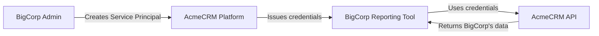
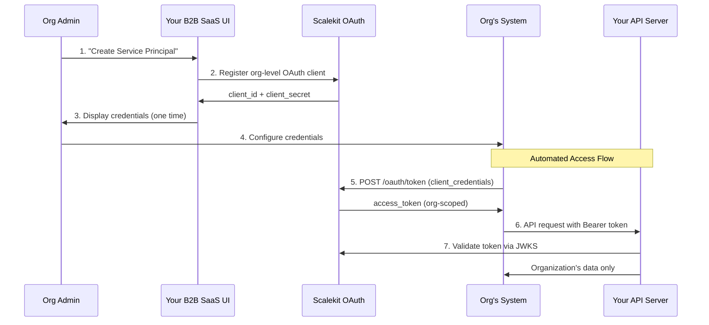

**Enable your tenant organizations to create automated access to your APIs**

Service Principals provide organization-level authentication for your B2B SaaS platform, allowing tenant organizations to create automated systems that access your APIs on behalf of the entire organization. This guide shows you how to implement OAuth 2.1 Client Credentials flow for organization-level API access.

## What are Service Principals?

Service Principals are **organization-owned OAuth clients** that act on behalf of an entire tenant organization rather than individual users. They enable organizations to build automation, integrations, and workflows that access your APIs without requiring user interaction.

### Real-World Example: AcmeCRM Platform

**Your B2B SaaS:** AcmeCRM - customer relationship management platform  
**Tenant Organization:** BigCorp - enterprise customer using AcmeCRM  
**Use Case:** BigCorp wants their internal reporting tool to automatically pull customer data from AcmeCRM every morning



**Flow:**

1. BigCorp admin logs into AcmeCRM and creates a Service Principal
2. AcmeCRM provides `client_id` and `client_secret` scoped to BigCorp's organization
3. BigCorp configures their reporting tool with these credentials
4. Reporting tool uses Client Credentials flow to access AcmeCRM's API
5. AcmeCRM returns only BigCorp's organizational data

## When Organizations Use Service Principals

Your tenant organizations will create Service Principals for:

### **Internal Automation Tools**

- ✅ **Business Intelligence** - Automated reports pulling data from your platform
- ✅ **Data Warehousing** - ETL processes syncing data to analytics systems
- ✅ **Monitoring Dashboards** - Real-time dashboards showing organizational metrics

### **Integration Systems**  

- ✅ **ERP Integration** - Syncing data between your platform and their ERP system
- ✅ **Marketing Automation** - Connecting your platform to their marketing tools
- ✅ **Customer Support** - Integrating with their helpdesk and support systems

### **Scheduled Workflows**

- ✅ **Backup Systems** - Automated data backup and archival processes  
- ✅ **Compliance Reporting** - Scheduled generation of compliance reports
- ✅ **Data Synchronization** - Regular sync between your platform and their systems

## Implementation Overview



---

## Step 1: Set Up Service Principal Creation in Your Application

### Prerequisites

- Scalekit environment configured for your B2B SaaS
- Admin interface in your application for organization management
- Understanding of your organization data model

### Add Service Principal Management to Your Admin UI

```javascript
// React component for organization admins
import React, { useState } from 'react';

const ServicePrincipalManager = ({ organizationId }) => {
  const [servicePrincipals, setServicePrincipals] = useState([]);
  const [isCreating, setIsCreating] = useState(false);

  const createServicePrincipal = async (formData) => {
    setIsCreating(true);
    try {
      // Call your backend API to create Service Principal via Scalekit
      const response = await fetch('/api/admin/service-principals', {
        method: 'POST',
        headers: { 'Content-Type': 'application/json' },
        body: JSON.stringify({
          organization_id: organizationId,
          name: formData.name,
          description: formData.description,
          scopes: formData.scopes,
          expiry: formData.tokenLifetime
        })
      });
      
      const newServicePrincipal = await response.json();
      setServicePrincipals([...servicePrincipals, newServicePrincipal]);
      
      // Show credentials modal (one-time display)
      showCredentialsModal(newServicePrincipal);
    } catch (error) {
      console.error('Failed to create Service Principal:', error);
    } finally {
      setIsCreating(false);
    }
  };

  return (
    <div className="service-principal-manager">
      <h3>API Access for {organizationName}</h3>
      <p>Create Service Principals to enable your organization's systems to access our API automatically.</p>
      
      <ServicePrincipalForm onSubmit={createServicePrincipal} />
      <ServicePrincipalList principals={servicePrincipals} />
    </div>
  );
};
```

### Backend API for Service Principal Creation

```javascript
// Node.js Express endpoint
app.post('/api/admin/service-principals', authenticateOrgAdmin, async (req, res) => {
  try {
    const { organization_id, name, description, scopes, expiry } = req.body;
    
    // Verify admin has permission for this organization
    if (!canManageOrganization(req.user, organization_id)) {
      return res.status(403).json({ error: 'Insufficient permissions' });
    }
    
    // Create Service Principal via Scalekit
    const servicePrincipal = await scalekit.m2mClient.createOrganizationClient(
      organization_id,
      {
        name: `${name} (${organization_id})`,
        description: `${description} - Created by ${req.user.email}`,
        scopes: scopes,
        audience: [`api.yourcompany.com`],
        expiry: expiry || 3600,
        custom_claims: [
          { key: "organization_id", value: organization_id },
          { key: "created_by", value: req.user.id },
          { key: "client_type", value: "service_principal" }
        ]
      }
    );
    
    // Store reference in your database
    await db.servicePrincipals.create({
      client_id: servicePrincipal.client.client_id,
      organization_id: organization_id,
      name: name,
      description: description,
      scopes: scopes,
      created_by: req.user.id,
      created_at: new Date(),
      status: 'active'
    });
    
    // Return credentials (only shown once)
    res.json({
      client_id: servicePrincipal.client.client_id,
      client_secret: servicePrincipal.plain_secret, // Only returned here!
      name: name,
      scopes: scopes,
      created_at: servicePrincipal.client.create_time
    });
    
  } catch (error) {
    console.error('Service Principal creation failed:', error);
    res.status(500).json({ error: 'Failed to create Service Principal' });
  }
});
```

```python
# Python Flask endpoint
@app.route('/api/admin/service-principals', methods=['POST'])
@require_org_admin
def create_service_principal():
    data = request.get_json()
    organization_id = data['organization_id']
    
    # Verify admin permissions
    if not can_manage_organization(current_user, organization_id):
        return jsonify({'error': 'Insufficient permissions'}), 403
    
    try:
        # Create via Scalekit
        service_principal = scalekit.m2m_client.create_organization_client(
            organization_id=organization_id,
            name=f"{data['name']} ({organization_id})",
            description=f"{data['description']} - Created by {current_user.email}",
            scopes=data['scopes'],
            audience=['api.yourcompany.com'],
            expiry=data.get('expiry', 3600),
            custom_claims=[
                {'key': 'organization_id', 'value': organization_id},
                {'key': 'created_by', 'value': str(current_user.id)},
                {'key': 'client_type', 'value': 'service_principal'}
            ]
        )
        
        # Store in database
        db.session.add(ServicePrincipal(
            client_id=service_principal.client.client_id,
            organization_id=organization_id,
            name=data['name'],
            description=data['description'],
            scopes=data['scopes'],
            created_by=current_user.id
        ))
        db.session.commit()
        
        return jsonify({
            'client_id': service_principal.client.client_id,
            'client_secret': service_principal.plain_secret,
            'name': data['name'],
            'scopes': data['scopes'],
            'created_at': service_principal.client.create_time
        })
        
    except Exception as error:
        return jsonify({'error': 'Failed to create Service Principal'}), 500
```

---

## Step 2: Configure Organization-Scoped Access

### Design Organization-Aware Scopes

```javascript
// Example scopes for a CRM platform
const CRM_SCOPES = {
  // Customer data access
  'read:customers': 'Read customer information for your organization',
  'write:customers': 'Create and update customer records',
  'delete:customers': 'Delete customer records',
  
  // Contact management
  'read:contacts': 'Access contact lists and details',
  'write:contacts': 'Manage contacts and communication history',
  
  // Sales data
  'read:deals': 'View sales opportunities and pipeline',
  'write:deals': 'Manage sales deals and stages',
  'read:revenue': 'Access revenue and sales metrics',
  
  // Reporting and analytics
  'read:reports': 'Generate and access reports',
  'read:analytics': 'Access analytics and insights',
  
  // Integration capabilities
  'webhook:receive': 'Receive webhook notifications',
  'export:data': 'Export organizational data'
};

// Scope categories for UI organization
const SCOPE_CATEGORIES = {
  'Customer Management': ['read:customers', 'write:customers', 'delete:customers'],
  'Contact Management': ['read:contacts', 'write:contacts'],
  'Sales Pipeline': ['read:deals', 'write:deals', 'read:revenue'],
  'Reporting': ['read:reports', 'read:analytics'],
  'Integration': ['webhook:receive', 'export:data']
};
```

### Organization Context in Tokens

When organizations use their Service Principal credentials, tokens automatically include organization context:

```json
{
  "client_id": "sp_org_bigcorp_reporting_tool",
  "exp": 1745305340,
  "iat": 1745218940,
  "iss": "https://your-env.scalekit.com",
  "jti": "tkn_69041163914445100",
  "nbf": 1745218940,
  "oid": "org_bigcorp_12345",
  "scopes": [
    "read:customers",
    "read:deals", 
    "read:analytics"
  ],
  "sub": "sp_org_bigcorp_reporting_tool",
  "custom_claims": {
    "organization_id": "org_bigcorp_12345",
    "created_by": "admin_user_456",
    "client_type": "service_principal"
  }
}
```

---

## Step 3: Help Organizations Configure Their Systems

### Provide Clear Setup Instructions

Create documentation for your customers' organizations:

```markdown
# Setting Up BigCorp Reporting Tool Integration

## Step 1: Create Service Principal
1. Log into AcmeCRM as an organization administrator
2. Go to Settings → API Access → Service Principals  
3. Click "Create New Service Principal"
4. Configure:
   - Name: "BigCorp Reporting Tool"
   - Description: "Automated daily reports for executive team"
   - Scopes: read:customers, read:deals, read:analytics
   - Token Lifetime: 1 hour

## Step 2: Configure Your Reporting Tool
Use these credentials in your reporting tool configuration:

**API Endpoint:** https://api.acmecrm.com
**OAuth Token URL:** https://your-env.scalekit.com/oauth/token  
**Client ID:** sp_org_bigcorp_reporting_tool
**Client Secret:** [Shown once during creation]
**Scopes:** read:customers read:deals read:analytics
```

### Example Integration Code for Organizations

```javascript
// Example: Organization's reporting tool implementation
class AcmeCRMReportingClient {
  constructor(clientId, clientSecret) {
    this.clientId = clientId;
    this.clientSecret = clientSecret;
    this.tokenUrl = 'https://your-env.scalekit.com/oauth/token';
    this.apiUrl = 'https://api.acmecrm.com';
    this.tokenCache = null;
  }

  async getAccessToken() {
    // Check if cached token is still valid
    if (this.tokenCache && this.tokenCache.expiresAt > Date.now() + 60000) {
      return this.tokenCache.token;
    }

    try {
      const response = await fetch(this.tokenUrl, {
        method: 'POST',
        headers: { 'Content-Type': 'application/x-www-form-urlencoded' },
        body: new URLSearchParams({
          grant_type: 'client_credentials',
          client_id: this.clientId,
          client_secret: this.clientSecret,
          scope: 'read:customers read:deals read:analytics'
        })
      });

      if (!response.ok) {
        throw new Error(`Token request failed: ${response.statusText}`);
      }

      const tokenData = await response.json();
      
      // Cache token with buffer time
      this.tokenCache = {
        token: tokenData.access_token,
        expiresAt: Date.now() + (tokenData.expires_in * 1000) - 60000 // 1 min buffer
      };

      return tokenData.access_token;
    } catch (error) {
      console.error('Failed to get access token:', error);
      throw error;
    }
  }

  async generateDailyReport() {
    const token = await this.getAccessToken();
    
    try {
      // Get customer metrics
      const customers = await this.apiCall('/customers/metrics', token);
      
      // Get deals pipeline
      const deals = await this.apiCall('/deals/pipeline', token);
      
      // Get analytics data
      const analytics = await this.apiCall('/analytics/daily', token);
      
      return this.buildReport({ customers, deals, analytics });
    } catch (error) {
      console.error('Report generation failed:', error);
      throw error;
    }
  }

  async apiCall(endpoint, token) {
    const response = await fetch(`${this.apiUrl}${endpoint}`, {
      headers: {
        'Authorization': `Bearer ${token}`,
        'Content-Type': 'application/json'
      }
    });

    if (!response.ok) {
      throw new Error(`API call failed: ${response.statusText}`);
    }

    return await response.json();
  }

  buildReport(data) {
    return {
      generated_at: new Date().toISOString(),
      organization: 'BigCorp',
      summary: {
        total_customers: data.customers.total,
        active_deals: data.deals.active_count,
        monthly_revenue: data.analytics.monthly_revenue
      },
      // ... detailed report data
    };
  }
}

// Usage in organization's system
const reportingClient = new AcmeCRMReportingClient(
  process.env.ACMECRM_CLIENT_ID,
  process.env.ACMECRM_CLIENT_SECRET
);

// Schedule daily report generation
cron.schedule('0 9 * * *', async () => {
  try {
    const report = await reportingClient.generateDailyReport();
    await sendReportToExecutives(report);
    console.log('Daily report sent successfully');
  } catch (error) {
    console.error('Daily report failed:', error);
    await alertReportingTeam(error);
  }
});
```

---

## Step 4: Implement Organization-Aware Token Validation

Your API must validate tokens and enforce organization-level data isolation:

### Organization-Scoped Token Validation

```javascript
// Enhanced token validation with organization context
import jwt from 'jsonwebtoken';
import jwksClient from 'jwks-rsa';

const client = jwksClient({
  jwksUri: 'https://your-env.scalekit.com/.well-known/jwks',
  cache: true,
  cacheMaxAge: 600000, // 10 minutes
  rateLimit: true
});

function getKey(header, callback) {
  client.getSigningKey(header.kid, (err, key) => {
    if (err) return callback(err);
    const signingKey = key.getPublicKey();
    callback(null, signingKey);
  });
}

const validateServicePrincipal = async (req, res, next) => {
  const authHeader = req.headers.authorization;
  
  if (!authHeader || !authHeader.startsWith('Bearer ')) {
    return res.status(401).json({
      error: 'unauthorized',
      message: 'Bearer token required'
    });
  }

  const token = authHeader.substring(7);

  try {
    const decoded = await new Promise((resolve, reject) => {
      jwt.verify(token, getKey, {
        algorithms: ['RS256'],
        issuer: 'https://your-env.scalekit.com',
        audience: 'api.yourcompany.com'
      }, (err, decoded) => {
        if (err) reject(err);
        else resolve(decoded);
      });
    });

    // Extract organization context
    const organizationId = decoded.oid || decoded.custom_claims?.organization_id;
    
    if (!organizationId) {
      return res.status(401).json({
        error: 'invalid_token',
        message: 'Token missing organization context'
      });
    }

    // Verify organization is active
    const organization = await getOrganization(organizationId);
    if (!organization || organization.status !== 'active') {
      return res.status(401).json({
        error: 'invalid_organization',
        message: 'Organization is inactive or not found'
      });
    }

    // Attach context to request
    req.auth = {
      clientId: decoded.client_id,
      organizationId: organizationId,
      organization: organization,
      scopes: decoded.scopes || [],
      customClaims: decoded.custom_claims || {},
      tokenType: 'service_principal',
      issuedAt: decoded.iat,
      expiresAt: decoded.exp
    };

    next();
  } catch (error) {
    console.error('Token validation failed:', error.message);
    return res.status(401).json({
      error: 'invalid_token',
      message: 'Token validation failed'
    });
  }
};
```

### Organization Data Isolation

```javascript
// Middleware to enforce organization data boundaries
const enforceOrganizationScope = (req, res, next) => {
  // Add organization filter to all database queries
  req.organizationFilter = {
    organization_id: req.auth.organizationId
  };
  
  next();
};

// Database query helpers that automatically scope to organization
const createOrgScopedQuery = (baseQuery, organizationId) => {
  return {
    ...baseQuery,
    where: {
      ...baseQuery.where,
      organization_id: organizationId
    }
  };
};

// Usage in API endpoints
app.get('/api/customers', 
  validateServicePrincipal,
  requireScope('read:customers'),
  enforceOrganizationScope,
  async (req, res) => {
    try {
      // Query automatically scoped to organization
      const customers = await db.customers.findAll(
        createOrgScopedQuery(
          {
            limit: req.query.limit || 100,
            offset: req.query.offset || 0,
            order: [['created_at', 'DESC']]
          },
          req.auth.organizationId
        )
      );
      
      res.json({
        customers: customers,
        organization_id: req.auth.organizationId,
        total_count: customers.length
      });
    } catch (error) {
      res.status(500).json({ error: 'Failed to fetch customers' });
    }
  }
);
```

---

## Step 5: Monitoring and Organization Management

### Service Principal Usage Analytics

```javascript
// Track Service Principal usage by organization
const trackServicePrincipalUsage = (req, endpoint, success) => {
  const usage = {
    timestamp: new Date().toISOString(),
    organization_id: req.auth.organizationId,
    client_id: req.auth.clientId,
    endpoint: endpoint,
    success: success,
    scopes_used: req.auth.scopes,
    response_time: Date.now() - req.startTime
  };
  
  // Log to analytics system
  analytics.track('service_principal_api_usage', usage);
  
  // Update organization usage metrics
  updateOrganizationApiUsage(req.auth.organizationId, endpoint);
};

// Middleware to track API usage
const trackAPIUsage = (req, res, next) => {
  req.startTime = Date.now();
  
  // Override res.json to track completion
  const originalJson = res.json;
  res.json = function(data) {
    trackServicePrincipalUsage(req, req.path, res.statusCode < 400);
    return originalJson.call(this, data);
  };
  
  next();
};
```

### Organization Admin Dashboard

```javascript
// API endpoint for organization admins to view Service Principal usage
app.get('/api/admin/service-principals/:clientId/usage',
  authenticateOrgAdmin,
  async (req, res) => {
    const { clientId } = req.params;
    
    try {
      // Verify admin owns this Service Principal
      const servicePrincipal = await db.servicePrincipals.findOne({
        where: { 
          client_id: clientId,
          organization_id: req.user.organization_id 
        }
      });
      
      if (!servicePrincipal) {
        return res.status(404).json({ error: 'Service Principal not found' });
      }
      
      // Get usage analytics
      const usage = await analytics.getServicePrincipalUsage(clientId, {
        timeframe: req.query.timeframe || '7d',
        breakdown: req.query.breakdown || 'daily'
      });
      
      res.json({
        service_principal: servicePrincipal,
        usage: usage,
        summary: {
          total_requests: usage.total_requests,
          success_rate: usage.success_rate,
          most_used_endpoints: usage.top_endpoints,
          last_used: usage.last_activity
        }
      });
    } catch (error) {
      res.status(500).json({ error: 'Failed to fetch usage data' });
    }
  }
);
```

---

## Common Organization Use Cases

### Use Case 1: Business Intelligence Integration

**Scenario:** BigCorp uses Tableau for business intelligence and wants to create automated dashboards with data from your CRM platform.

```javascript
// BigCorp's Tableau integration
class TableauCRMConnector {
  constructor(clientId, clientSecret) {
    this.crmClient = new AcmeCRMReportingClient(clientId, clientSecret);
  }
  
  async fetchDataForTableau() {
    const token = await this.crmClient.getAccessToken();
    
    // Fetch data required for Tableau dashboard
    const [customers, deals, revenue] = await Promise.all([
      this.crmClient.apiCall('/customers/summary', token),
      this.crmClient.apiCall('/deals/pipeline-data', token),
      this.crmClient.apiCall('/analytics/revenue-trends', token)
    ]);
    
    // Transform to Tableau-compatible format
    return this.transformForTableau({ customers, deals, revenue });
  }
}
```

### Use Case 2: ERP System Integration

**Scenario:** BigCorp wants to sync customer data between your CRM and their SAP ERP system.

```javascript
// BigCorp's SAP integration service
class SAPCRMSync {
  constructor(crmCredentials, sapCredentials) {
    this.crmClient = new AcmeCRMReportingClient(
      crmCredentials.clientId, 
      crmCredentials.clientSecret
    );
    this.sapClient = new SAPClient(sapCredentials);
  }
  
  async syncCustomers() {
    // Get updated customers from CRM
    const token = await this.crmClient.getAccessToken();
    const updatedCustomers = await this.crmClient.apiCall(
      '/customers/modified-since/' + this.getLastSyncTime(), 
      token
    );
    
    // Sync to SAP
    for (const customer of updatedCustomers) {
      await this.sapClient.upsertCustomer(
        this.transformCustomerForSAP(customer)
      );
    }
    
    this.updateLastSyncTime();
  }
}
```

### Use Case 3: Compliance Reporting

**Scenario:** BigCorp needs automated GDPR compliance reports showing data processing activities.

```javascript
// BigCorp's compliance reporting
class ComplianceReporter {
  constructor(clientId, clientSecret) {
    this.crmClient = new AcmeCRMReportingClient(clientId, clientSecret);
  }
  
  async generateGDPRReport(startDate, endDate) {
    const token = await this.crmClient.getAccessToken();
    
    const [dataProcessing, userConsents, dataExports] = await Promise.all([
      this.crmClient.apiCall(`/audit/data-processing?start=${startDate}&end=${endDate}`, token),
      this.crmClient.apiCall(`/privacy/consent-records?start=${startDate}&end=${endDate}`, token),
      this.crmClient.apiCall(`/privacy/data-exports?start=${startDate}&end=${endDate}`, token)
    ]);
    
    return this.buildGDPRReport({
      period: { start: startDate, end: endDate },
      data_processing_activities: dataProcessing,
      consent_records: userConsents,
      data_exports: dataExports,
      organization: 'BigCorp'
    });
  }
}
```

---

## Service Principal Management Best Practices

### 1. Credential Security Guidelines

Provide clear security guidance to your organizations:

```markdown
# Service Principal Security Best Practices

## Credential Storage
- ✅ Store credentials in secure secret management (HashiCorp Vault, AWS Secrets Manager)
- ✅ Use environment variables for local development  
- ❌ Never commit credentials to version control
- ❌ Never hardcode credentials in application code

## Access Control
- ✅ Create separate Service Principals for different systems
- ✅ Use minimal required scopes for each use case
- ✅ Rotate credentials regularly (every 90 days)
- ✅ Monitor usage and audit access patterns

## Token Management  
- ✅ Cache tokens appropriately (with buffer time before expiry)
- ✅ Handle token refresh gracefully
- ✅ Implement proper error handling for expired tokens
- ❌ Never store tokens in logs or error messages
```

### 2. Scope Design for Organizations

```javascript
// Example scope hierarchy for different organization needs
const ORGANIZATION_SCOPE_TEMPLATES = {
  'reporting_readonly': [
    'read:customers',
    'read:deals', 
    'read:analytics',
    'read:reports'
  ],
  
  'bi_integration': [
    'read:customers',
    'read:deals',
    'read:contacts', 
    'read:analytics',
    'export:data'
  ],
  
  'erp_sync': [
    'read:customers',
    'write:customers',
    'read:deals',
    'write:deals',
    'webhook:receive'
  ],
  
  'compliance_audit': [
    'read:audit-logs',
    'read:privacy-records',
    'read:data-processing',
    'export:compliance-data'
  ]
};
```

### 3. Usage Monitoring and Alerts

```javascript
// Set up monitoring for unusual Service Principal activity
const monitorServicePrincipalUsage = () => {
  // Alert on unusual patterns
  const alerts = [
    {
      condition: 'requests_per_hour > normal_usage * 3',
      action: 'notify_org_admin',
      message: 'Unusual API usage detected for Service Principal'
    },
    {
      condition: 'failed_requests > 50 in 10_minutes', 
      action: 'temporary_rate_limit',
      message: 'High failure rate detected'
    },
    {
      condition: 'new_scope_requested',
      action: 'require_admin_approval',
      message: 'Service Principal requesting additional scopes'
    }
  ];
  
  return alerts;
};
```

---

## Troubleshooting for Organizations

### Common Issues Organizations Face

**Issue: "invalid_client" Error**

```javascript
// Help organizations debug credential issues
const debugServicePrincipal = async (clientId, clientSecret) => {
  try {
    const response = await fetch('https://your-env.scalekit.com/oauth/token', {
      method: 'POST',
      headers: { 'Content-Type': 'application/x-www-form-urlencoded' },
      body: new URLSearchParams({
        grant_type: 'client_credentials',
        client_id: clientId,
        client_secret: clientSecret
      })
    });
    
    if (!response.ok) {
      const error = await response.json();
      console.error('Authentication failed:', error);
      
      // Provide helpful error messages
      if (error.error === 'invalid_client') {
        console.log('💡 Check: Are your client_id and client_secret correct?');
        console.log('💡 Check: Was this Service Principal created in the correct organization?');
        console.log('💡 Check: Is the Service Principal still active?');
      }
    }
  } catch (error) {
    console.error('Network error:', error);
  }
};
```

**Issue: Organization Data Not Appearing**

```javascript
// Debug organization context issues
const debugOrganizationAccess = (token) => {
  const decoded = jwt.decode(token);
  console.log('Token organization context:');
  console.log('Organization ID:', decoded.oid);
  console.log('Custom claims:', decoded.custom_claims);
  console.log('Scopes:', decoded.scopes);
  
  if (!decoded.oid) {
    console.error('❌ Token missing organization context');
    console.log('💡 This may be an issue with Service Principal configuration');
  }
};
```

---

## Next Steps

✅ **Service Principals Implemented!** Your tenant organizations can now create automated API access.

**What's Next:**

1. **[Add Third-Party App Support](/guides/m2m/user-delegated-access/)** - Enable external developer integrations
2. **[Implement Advanced Scoping](/guides/m2m/scopes-permissions/)** - Design sophisticated permission models  

**For Your Organizations:**

- Provide clear documentation on Service Principal creation
- Set up monitoring and usage analytics  
- Establish credential rotation policies
- Create example integration code for common use cases
