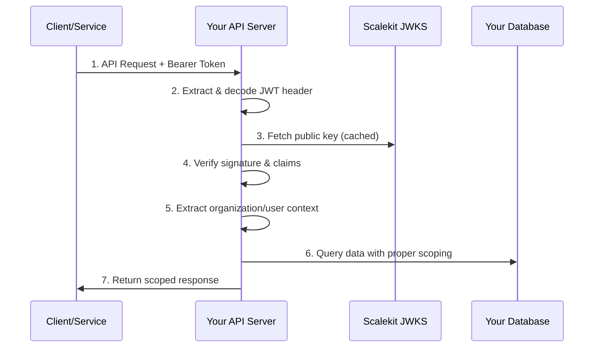

**Implement secure, high-performance token validation for your B2B SaaS APIs**

Token verification is the process of validating JWT tokens issued by Scalekit OAuth in your API endpoints. This ensures that only authenticated services, organizations, and users can access your APIs with the appropriate permissions.

## What is Token Verification?

Token verification validates three critical aspects of incoming API requests:

1. **Token Authenticity** - Verify the token was issued by Scalekit OAuth
2. **Token Validity** - Check expiration, audience, and issuer claims
3. **Authorization Context** - Extract organization, user, or service identity for data scoping

### Token Verification Flow



## When You Need Token Verification

Implement token verification for:

### **All Protected API Endpoints**

- ✅ **Public APIs** accessed by Service Principals or Third-Party Apps
- ✅ **Internal APIs** used by your microservices
- ✅ **Admin APIs** for organization management
- ✅ **Webhook endpoints** that process sensitive data

### **Multi-Tenant Data Protection**

- ✅ **Organization isolation** - Prevent data leaks between tenants
- ✅ **User-scoped access** - Ensure users only see their own data
- ✅ **Service permissions** - Control which services can access what APIs

### **Compliance Requirements**

- ✅ **Audit logging** - Track who accessed what data when
- ✅ **Access controls** - Enforce principle of least privilege
- ✅ **Data sovereignty** - Comply with regulatory requirements

---

## Implementation Approaches

### Approach 1: JWKS Validation (Recommended)

**Best for:** High-performance applications with caching requirements

JWKS (JSON Web Key Set) validation uses public keys to verify JWT signatures locally without calling Scalekit for every request.

```javascript
// High-performance JWKS validation
import jwt from 'jsonwebtoken';
import jwksClient from 'jwks-rsa';

const client = jwksClient({
  jwksUri: 'https://your-env.scalekit.com/.well-known/jwks',
  cache: true,
  cacheMaxAge: 600000, // 10 minutes
  rateLimit: true
});

const validateToken = async (token) => {
  return new Promise((resolve, reject) => {
    jwt.verify(token, getKey, {
      algorithms: ['RS256'],
      audience: 'api.yourcompany.com',
      issuer: 'https://your-env.scalekit.com'
    }, (err, decoded) => {
      if (err) reject(err);
      else resolve(decoded);
    });
  });
};

function getKey(header, callback) {
  client.getSigningKey(header.kid, (err, key) => {
    if (err) return callback(err);
    callback(null, key.getPublicKey());
  });
}
```

**Benefits:**

- **High Performance** - No network calls after key caching
- **Offline Validation** - Works without external dependencies
- **Stateless** - No token storage required

### Approach 2: Token Introspection

**Best for:** Applications requiring real-time token revocation

Token introspection validates tokens by calling Scalekit's introspection endpoint for each request.

```javascript
// Token introspection validation
const introspectToken = async (token) => {
  const response = await fetch('https://your-env.scalekit.com/oauth/introspect', {
    method: 'POST',
    headers: { 'Content-Type': 'application/x-www-form-urlencoded' },
    body: `token=${token}&token_type_hint=access_token`
  });
  
  const result = await response.json();
  
  if (!result.active) {
    throw new Error('Token is not active');
  }
  
  return result;
};
```

**Benefits:**

- **Real-time Revocation** - Immediately reflects token revocation
- **Additional Metadata** - Returns extra token information
- **Centralized Control** - All validation logic in Scalekit

---

## Step 1: Choose Your Validation Strategy

### Performance vs. Real-time Trade-offs

| Factor | JWKS Validation | Token Introspection |
|--------|----------------|-------------------|
| **Latency** | ~1-5ms | ~50-100ms |
| **Throughput** | Very High | Medium |
| **Real-time Revocation** | No* | Yes |
| **Offline Capability** | Yes | No |
| **Implementation Complexity** | Medium | Low |

*JWKS validation can achieve near real-time revocation with short token lifetimes (5-15 minutes)

### Hybrid Approach

Many platforms use both methods strategically:

- **JWKS for microservices** - High-performance internal communication
- **Introspection for external APIs** - Real-time revocation for third-party access
- **JWKS with short TTL** - Balance performance and revocation speed

---

## Step 2: Implement Token Validation Middleware

### Universal Validation Middleware

```javascript
// Express middleware that works with any validation approach
const createTokenValidator = (validationStrategy) => {
  return async (req, res, next) => {
    const authHeader = req.headers.authorization;
    
    if (!authHeader?.startsWith('Bearer ')) {
      return res.status(401).json({ 
        error: 'unauthorized',
        message: 'Bearer token required' 
      });
    }

    const token = authHeader.substring(7);
    
    try {
      const decoded = await validationStrategy(token);
      
      // Attach authentication context
      req.auth = {
        // Universal fields
        subject: decoded.sub,
        clientId: decoded.client_id || decoded.aud,
        scopes: decoded.scopes || decoded.scope?.split(' ') || [],
        expiresAt: decoded.exp,
        
        // Context-specific fields
        organizationId: decoded.oid || decoded.organization_id,
        userId: decoded.sub?.startsWith('user_') ? decoded.sub : null,
        serviceName: decoded.custom_claims?.service_name,
        
        // Token metadata
        tokenType: decoded.custom_claims?.client_type || 'unknown',
        issuedAt: decoded.iat
      };
      
      next();
    } catch (error) {
      return res.status(401).json({
        error: 'invalid_token',
        message: 'Token validation failed'
      });
    }
  };
};

// Usage with different validation strategies
const app = express();

// JWKS validation for high-performance routes
app.use('/api/internal', createTokenValidator(validateTokenJWKS));

// Introspection for external APIs requiring real-time revocation
app.use('/api/external', createTokenValidator(introspectToken));
```

### Framework-Specific Examples

```python
# Python/Flask middleware
from functools import wraps
import jwt
import requests

def validate_token(f):
    @wraps(f)
    def decorated_function(*args, **kwargs):
        auth_header = request.headers.get('Authorization')
        
        if not auth_header or not auth_header.startswith('Bearer '):
            return jsonify({'error': 'Bearer token required'}), 401
        
        token = auth_header[7:]
        
        try:
            # JWKS validation
            decoded = jwt.decode(
                token,
                key=get_jwks_key,
                algorithms=['RS256'],
                audience='api.yourcompany.com',
                issuer='https://your-env.scalekit.com'
            )
            
            # Attach auth context to Flask g object
            g.auth = {
                'subject': decoded.get('sub'),
                'organization_id': decoded.get('oid'),
                'scopes': decoded.get('scopes', []),
                'service_name': decoded.get('custom_claims', {}).get('service_name')
            }
            
            return f(*args, **kwargs)
            
        except jwt.InvalidTokenError as e:
            return jsonify({'error': 'Invalid token'}), 401
    
    return decorated_function

# Usage
@app.route('/api/users')
@validate_token
def get_users():
    org_id = g.auth['organization_id']
    return get_users_for_organization(org_id)
```

---

## Step 3: Implement Context-Aware Data Scoping

### Automatic Organization Scoping

```javascript
// Middleware to automatically scope queries to organization
const enforceOrganizationScope = (req, res, next) => {
  if (!req.auth.organizationId) {
    return res.status(401).json({ 
      error: 'missing_organization_context',
      message: 'Token missing organization information' 
    });
  }
  
  // Add organization filter to all database operations
  req.orgQuery = (baseQuery) => ({
    ...baseQuery,
    where: {
      ...baseQuery.where,
      organization_id: req.auth.organizationId
    }
  });
  
  next();
};

// Usage in API endpoints
app.get('/api/customers', 
  validateToken,
  enforceOrganizationScope,
  async (req, res) => {
    // Query automatically scoped to organization
    const customers = await db.customers.findAll(
      req.orgQuery({
        limit: 100,
        order: [['created_at', 'DESC']]
      })
    );
    
    res.json({ customers, organization_id: req.auth.organizationId });
  }
);
```

### User-Scoped Access Control

```javascript
// Middleware for user-scoped data access
const enforceUserScope = (req, res, next) => {
  if (!req.auth.userId) {
    return res.status(401).json({ 
      error: 'missing_user_context',
      message: 'Token missing user information' 
    });
  }
  
  req.userQuery = (baseQuery) => ({
    ...baseQuery,
    where: {
      ...baseQuery.where,
      user_id: req.auth.userId
    }
  });
  
  next();
};

// API endpoint with user scoping
app.get('/api/projects',
  validateToken,
  enforceUserScope,
  async (req, res) => {
    const projects = await db.projects.findAll(
      req.userQuery({ order: [['updated_at', 'DESC']] })
    );
    
    res.json({ projects, user_id: req.auth.userId });
  }
);
```

---

## Performance Optimization

### Token Validation Caching

```javascript
// Redis-based token cache for high-traffic APIs
import Redis from 'redis';

class TokenCache {
  constructor() {
    this.redis = Redis.createClient(process.env.REDIS_URL);
  }
  
  async get(tokenHash) {
    const cached = await this.redis.get(`token:${tokenHash}`);
    return cached ? JSON.parse(cached) : null;
  }
  
  async set(tokenHash, decoded, ttlSeconds) {
    await this.redis.setex(
      `token:${tokenHash}`, 
      ttlSeconds, 
      JSON.stringify(decoded)
    );
  }
}

// Enhanced validation with caching
const validateTokenWithCache = async (token) => {
  const tokenHash = crypto.createHash('sha256').update(token).digest('hex');
  
  // Check cache first
  let decoded = await tokenCache.get(tokenHash);
  if (decoded) return decoded;
  
  // Validate and cache
  decoded = await validateTokenJWKS(token);
  const ttl = decoded.exp - Math.floor(Date.now() / 1000);
  await tokenCache.set(tokenHash, decoded, ttl);
  
  return decoded;
};
```

### Connection Pooling and Circuit Breakers

```javascript
// Resilient JWKS client with circuit breaker
import CircuitBreaker from 'opossum';

const jwksOptions = {
  timeout: 3000,
  errorThresholdPercentage: 50,
  resetTimeout: 30000
};

const getSigningKey = new CircuitBreaker(async (kid) => {
  return new Promise((resolve, reject) => {
    client.getSigningKey(kid, (err, key) => {
      if (err) reject(err);
      else resolve(key.getPublicKey());
    });
  });
}, jwksOptions);

// Fallback when JWKS is unavailable
getSigningKey.fallback(() => {
  console.warn('JWKS unavailable, using cached keys only');
  throw new Error('Token validation temporarily unavailable');
});
```

---

## Error Handling and Security

### Comprehensive Error Responses

```javascript
// Standardized error handling for token validation
const handleTokenError = (error, res) => {
  const errorMappings = {
    'TokenExpiredError': {
      status: 401,
      error: 'token_expired',
      message: 'Token has expired'
    },
    'JsonWebTokenError': {
      status: 401,
      error: 'invalid_token',
      message: 'Token is malformed'
    },
    'NotBeforeError': {
      status: 401,
      error: 'token_not_active',
      message: 'Token is not yet active'
    }
  };
  
  const errorResponse = errorMappings[error.name] || {
    status: 401,
    error: 'token_validation_failed',
    message: 'Token validation failed'
  };
  
  res.status(errorResponse.status).json({
    error: errorResponse.error,
    message: errorResponse.message
  });
};
```

### Security Headers and Logging

```javascript
// Security-focused token validation
const secureTokenValidator = (req, res, next) => {
  // Security headers
  res.set({
    'X-Content-Type-Options': 'nosniff',
    'X-Frame-Options': 'DENY',
    'X-XSS-Protection': '1; mode=block'
  });
  
  // Extract and validate token
  const token = extractBearerToken(req);
  if (!token) {
    logSecurityEvent('missing_token', req);
    return res.status(401).json({ error: 'unauthorized' });
  }
  
  validateToken(token)
    .then(decoded => {
      logSecurityEvent('token_validated', req, { 
        subject: decoded.sub,
        client_id: decoded.client_id 
      });
      req.auth = decoded;
      next();
    })
    .catch(error => {
      logSecurityEvent('token_validation_failed', req, { error: error.message });
      handleTokenError(error, res);
    });
};

const logSecurityEvent = (event, req, metadata = {}) => {
  console.log(JSON.stringify({
    timestamp: new Date().toISOString(),
    event,
    ip: req.ip,
    user_agent: req.get('User-Agent'),
    path: req.path,
    method: req.method,
    ...metadata
  }));
};
```

---

## Testing and Validation

### Token Validation Testing

```javascript
// Unit tests for token validation
describe('Token Validation', () => {
  it('should validate valid JWT tokens', async () => {
    const mockToken = createMockJWT({
      sub: 'user_123',
      oid: 'org_456',
      scopes: ['read:users'],
      exp: Math.floor(Date.now() / 1000) + 3600
    });
    
    const decoded = await validateToken(mockToken);
    expect(decoded.sub).toBe('user_123');
    expect(decoded.oid).toBe('org_456');
  });
  
  it('should reject expired tokens', async () => {
    const expiredToken = createMockJWT({
      exp: Math.floor(Date.now() / 1000) - 3600 // Expired 1 hour ago
    });
    
    await expect(validateToken(expiredToken)).rejects.toThrow('TokenExpiredError');
  });
  
  it('should reject tokens with invalid audience', async () => {
    const invalidToken = createMockJWT({
      aud: 'wrong-audience.com'
    });
    
    await expect(validateToken(invalidToken)).rejects.toThrow('Invalid audience');
  });
});
```

---

## Monitoring and Observability

### Key Metrics to Track

```javascript
// Prometheus metrics for token validation
import client from 'prom-client';

const tokenValidationCounter = new client.Counter({
  name: 'token_validations_total',
  help: 'Total number of token validations',
  labelNames: ['status', 'token_type', 'client_id']
});

const tokenValidationDuration = new client.Histogram({
  name: 'token_validation_duration_seconds',
  help: 'Token validation latency',
  buckets: [0.001, 0.005, 0.01, 0.05, 0.1, 0.5]
});

// Integration into validation middleware
const trackTokenValidation = (status, tokenType, clientId, duration) => {
  tokenValidationCounter.labels(status, tokenType, clientId).inc();
  tokenValidationDuration.observe(duration);
};
```

### Health Checks

```javascript
// Health check endpoint that validates token infrastructure
app.get('/health/token-validation', async (req, res) => {
  try {
    // Check JWKS endpoint
    const jwksResponse = await fetch('https://your-env.scalekit.com/.well-known/jwks');
    if (!jwksResponse.ok) throw new Error('JWKS unavailable');
    
    // Check token cache if using Redis
    if (tokenCache) {
      await tokenCache.redis.ping();
    }
    
    res.json({ 
      status: 'healthy',
      jwks_status: 'available',
      cache_status: tokenCache ? 'available' : 'not_configured'
    });
  } catch (error) {
    res.status(503).json({ 
      status: 'unhealthy',
      error: error.message 
    });
  }
});
```

---

## Next Steps

✅ **Token Verification Implemented!** Your APIs now securely validate OAuth tokens.

**What's Next:**

1. **[Scopes & Permissions](/guides/m2m/scopes-permissions/)** - Implement fine-grained authorization
2. **[Service Principals](/guides/m2m/service-principals/)** - Enable organization API access
3. **[Third-Party Apps](/guides/m2m/user-delegated-access/)** - Build developer ecosystem

**For Your Implementation:**

- Choose validation strategy based on performance vs. real-time requirements
- Implement comprehensive error handling and security logging
- Set up monitoring for token validation performance
- Test token validation with expired, malformed, and edge-case tokens
