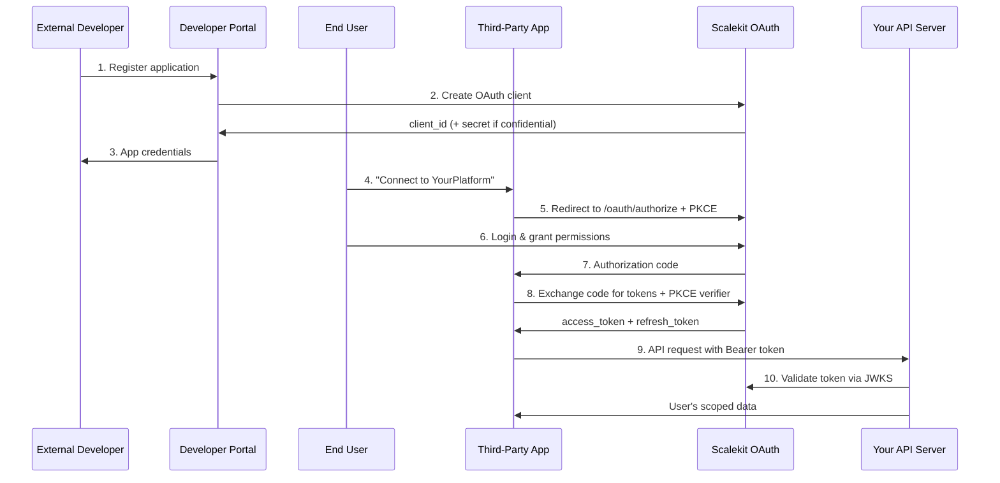

**Enable external developers to build integrations that access your APIs on behalf of users**

Third-Party Apps allow external applications to access your platform's APIs with explicit user consent using OAuth 2.1 Authorization Code flow with PKCE. This creates a developer ecosystem around your B2B SaaS platform.

## When to Enable Third-Party Apps

Third-Party Apps are perfect for building platform ecosystem:

- ✅ **Partner Integrations** - Marketing tools, analytics platforms, CRM systems
- ✅ **Mobile Applications** - iOS/Android apps built by external developers  
- ✅ **Customer Solutions** - Custom apps your customers build using your APIs
- ✅ **Marketplace Apps** - Plugin ecosystem, app stores, third-party extensions
- ✅ **Integration Platforms** - Zapier, IFTTT, automation tools connecting to your platform
- ✅ **Analytics & Reporting** - Third-party business intelligence and reporting tools

## Implementation Overview



---

## Step 1: Set Up Developer Portal and App Registration

### Create Developer Registration Flow

```javascript
// Developer portal - app registration API
app.post('/api/developer/apps', authenticateDeveloper, async (req, res) => {
  try {
    const { name, description, redirect_uris, scopes, app_type } = req.body;
    
    // Validate requested scopes against allowed public scopes
    const allowedScopes = await getPublicAPIScopes();
    const validScopes = scopes.filter(scope => allowedScopes.includes(scope));
    
    if (validScopes.length !== scopes.length) {
      return res.status(400).json({
        error: 'invalid_scope',
        message: 'Some requested scopes are not available for third-party apps'
      });
    }
    
    // Create OAuth client via Scalekit
    const oauthClient = await scalekit.m2mClient.createOrganizationClient(
      'platform-developers', // Special org for third-party developers
      {
        name: `${name} (Developer: ${req.developer.email})`,
        description: `${description} - Third-party application`,
        scopes: validScopes,
        audience: ['api.yourplatform.com'],
        expiry: 3600, // 1 hour access tokens
        custom_claims: [
          { key: "app_type", value: "third_party" },
          { key: "developer_id", value: req.developer.id },
          { key: "redirect_uris", value: redirect_uris.join(',') }
        ]
      }
    );
    
    // Store app registration in your database
    const app = await db.developerApps.create({
      client_id: oauthClient.client.client_id,
      developer_id: req.developer.id,
      name: name,
      description: description,
      app_type: app_type, // 'web', 'spa', 'mobile', 'server'
      redirect_uris: redirect_uris,
      scopes: validScopes,
      status: 'pending_review', // Require manual approval for security
      created_at: new Date()
    });
    
    // Return app details (client_secret only for confidential clients)
    const response = {
      app_id: app.id,
      client_id: oauthClient.client.client_id,
      name: name,
      scopes: validScopes,
      redirect_uris: redirect_uris,
      status: 'pending_review'
    };
    
    // Only include client_secret for server-side apps
    if (app_type === 'server') {
      response.client_secret = oauthClient.plain_secret;
    }
    
    res.json(response);
    
  } catch (error) {
    console.error('App registration failed:', error);
    res.status(500).json({ error: 'Failed to register application' });
  }
});
```

### Developer Portal UI

```jsx
// React component for app registration
import React, { useState } from 'react';

const AppRegistrationForm = () => {
  const [formData, setFormData] = useState({
    name: '',
    description: '',
    app_type: 'web',
    redirect_uris: [''],
    scopes: []
  });
  
  const availableScopes = [
    { id: 'read:profile', name: 'Read user profile', description: 'Access basic user information' },
    { id: 'read:projects', name: 'Read projects', description: 'View user\'s projects and tasks' },
    { id: 'write:projects', name: 'Manage projects', description: 'Create and update projects' },
    { id: 'read:team', name: 'Read team data', description: 'Access team information and members' },
    { id: 'read:analytics', name: 'Read analytics', description: 'View usage and performance metrics' }
  ];

  const handleSubmit = async (e) => {
    e.preventDefault();
    
    try {
      const response = await fetch('/api/developer/apps', {
        method: 'POST',
        headers: { 'Content-Type': 'application/json' },
        body: JSON.stringify(formData)
      });
      
      const newApp = await response.json();
      
      if (response.ok) {
        // Show success with credentials
        showAppCredentials(newApp);
      } else {
        setError(newApp.message);
      }
    } catch (error) {
      setError('Failed to register application');
    }
  };

  return (
    <div className="app-registration-form">
      <h2>Register Your Application</h2>
      <form onSubmit={handleSubmit}>
        <div className="form-group">
          <label>Application Name</label>
          <input
            type="text"
            value={formData.name}
            onChange={(e) => setFormData({...formData, name: e.target.value})}
            placeholder="My Awesome Integration"
            required
          />
        </div>
        
        <div className="form-group">
          <label>Description</label>
          <textarea
            value={formData.description}
            onChange={(e) => setFormData({...formData, description: e.target.value})}
            placeholder="Brief description of what your app does..."
            required
          />
        </div>
        
        <div className="form-group">
          <label>Application Type</label>
          <select
            value={formData.app_type}
            onChange={(e) => setFormData({...formData, app_type: e.target.value})}
          >
            <option value="web">Web Application (Server-side)</option>
            <option value="spa">Single Page Application</option>
            <option value="mobile">Mobile Application</option>
          </select>
        </div>
        
        <div className="form-group">
          <label>Redirect URIs</label>
          {formData.redirect_uris.map((uri, index) => (
            <input
              key={index}
              type="url"
              value={uri}
              onChange={(e) => {
                const newUris = [...formData.redirect_uris];
                newUris[index] = e.target.value;
                setFormData({...formData, redirect_uris: newUris});
              }}
              placeholder="https://your-app.com/oauth/callback"
              required
            />
          ))}
          <button type="button" onClick={() => 
            setFormData({...formData, redirect_uris: [...formData.redirect_uris, '']})
          }>
            Add Another URI
          </button>
        </div>
        
        <div className="form-group">
          <label>Requested Permissions</label>
          <div className="scope-selection">
            {availableScopes.map(scope => (
              <label key={scope.id} className="scope-item">
                <input
                  type="checkbox"
                  checked={formData.scopes.includes(scope.id)}
                  onChange={(e) => {
                    if (e.target.checked) {
                      setFormData({...formData, scopes: [...formData.scopes, scope.id]});
                    } else {
                      setFormData({...formData, scopes: formData.scopes.filter(s => s !== scope.id)});
                    }
                  }}
                />
                <div>
                  <strong>{scope.name}</strong>
                  <p>{scope.description}</p>
                </div>
              </label>
            ))}
          </div>
        </div>
        
        <button type="submit">Register Application</button>
      </form>
    </div>
  );
};
```

---

## Step 2: Implement OAuth Authorization Flow

### Authorization Endpoint Configuration

```javascript
// OAuth authorization endpoint
app.get('/oauth/authorize', async (req, res) => {
  const { 
    client_id, 
    redirect_uri, 
    scope, 
    state, 
    code_challenge, 
    code_challenge_method,
    response_type 
  } = req.query;
  
  try {
    // Validate client and redirect URI
    const app = await db.developerApps.findOne({
      where: { 
        client_id: client_id,
        status: 'approved' 
      }
    });
    
    if (!app) {
      return res.status(400).json({ 
        error: 'invalid_client',
        error_description: 'Invalid or unapproved client_id' 
      });
    }
    
    if (!app.redirect_uris.includes(redirect_uri)) {
      return res.status(400).json({ 
        error: 'invalid_request',
        error_description: 'redirect_uri not registered for this client' 
      });
    }
    
    // Validate requested scopes
    const requestedScopes = scope ? scope.split(' ') : [];
    const invalidScopes = requestedScopes.filter(s => !app.scopes.includes(s));
    
    if (invalidScopes.length > 0) {
      return res.status(400).json({ 
        error: 'invalid_scope',
        error_description: `Invalid scopes: ${invalidScopes.join(', ')}` 
      });
    }
    
    // Store authorization request for consent flow
    const authRequest = await db.authorizationRequests.create({
      client_id: client_id,
      redirect_uri: redirect_uri,
      scope: scope,
      state: state,
      code_challenge: code_challenge,
      code_challenge_method: code_challenge_method,
      expires_at: new Date(Date.now() + 10 * 60 * 1000) // 10 minutes
    });
    
    // Redirect to consent page (or login if not authenticated)
    if (!req.user) {
      return res.redirect(`/login?continue=${encodeURIComponent(req.originalUrl)}`);
    }
    
    res.redirect(`/oauth/consent?request_id=${authRequest.id}`);
    
  } catch (error) {
    console.error('Authorization error:', error);
    res.status(500).json({ error: 'server_error' });
  }
});
```

### User Consent Page

```jsx
// React component for user consent
import React, { useState, useEffect } from 'react';

const ConsentPage = ({ requestId }) => {
  const [authRequest, setAuthRequest] = useState(null);
  const [app, setApp] = useState(null);
  const [loading, setLoading] = useState(true);

  useEffect(() => {
    fetchAuthRequest();
  }, [requestId]);

  const fetchAuthRequest = async () => {
    try {
      const response = await fetch(`/api/oauth/consent/${requestId}`);
      const data = await response.json();
      setAuthRequest(data.request);
      setApp(data.app);
    } catch (error) {
      console.error('Failed to fetch auth request:', error);
    } finally {
      setLoading(false);
    }
  };

  const handleConsent = async (approved) => {
    try {
      const response = await fetch(`/api/oauth/consent/${requestId}`, {
        method: 'POST',
        headers: { 'Content-Type': 'application/json' },
        body: JSON.stringify({ approved })
      });
      
      const result = await response.json();
      
      if (approved && result.authorization_code) {
        // Redirect back to app with authorization code
        const redirectUrl = new URL(authRequest.redirect_uri);
        redirectUrl.searchParams.set('code', result.authorization_code);
        redirectUrl.searchParams.set('state', authRequest.state);
        window.location.href = redirectUrl.toString();
      } else {
        // Redirect with error
        const redirectUrl = new URL(authRequest.redirect_uri);
        redirectUrl.searchParams.set('error', 'access_denied');
        redirectUrl.searchParams.set('state', authRequest.state);
        window.location.href = redirectUrl.toString();
      }
    } catch (error) {
      console.error('Consent processing failed:', error);
    }
  };

  if (loading) return <div>Loading...</div>;

  const scopeDescriptions = {
    'read:profile': 'View your basic profile information',
    'read:projects': 'View your projects and tasks',
    'write:projects': 'Create and update your projects',
    'read:team': 'View your team information',
    'read:analytics': 'View your usage analytics'
  };

  const requestedScopes = authRequest.scope ? authRequest.scope.split(' ') : [];

  return (
    <div className="consent-page">
      <div className="consent-card">
        <div className="app-info">
          
          <h2>Authorize {app.name}</h2>
          <p className="app-developer">by {app.developer_name}</p>
        </div>
        
        <div className="consent-details">
          <p><strong>{app.name}</strong> wants to access your YourPlatform account</p>
          
          <div className="permissions">
            <h3>This application will be able to:</h3>
            <ul>
              {requestedScopes.map(scope => (
                <li key={scope}>
                  <span className="permission-icon">✓</span>
                  {scopeDescriptions[scope] || scope}
                </li>
              ))}
            </ul>
          </div>
          
          <div className="consent-actions">
            <button 
              className="btn-deny" 
              onClick={() => handleConsent(false)}
            >
              Deny
            </button>
            <button 
              className="btn-approve" 
              onClick={() => handleConsent(true)}
            >
              Allow Access
            </button>
          </div>
          
          <div className="consent-footer">
            <p>You can revoke this access at any time in your account settings.</p>
          </div>
        </div>
      </div>
    </div>
  );
};
```

### Token Exchange Implementation

```javascript
// Handle consent and issue authorization code
app.post('/api/oauth/consent/:requestId', authenticateUser, async (req, res) => {
  const { requestId } = req.params;
  const { approved } = req.body;
  
  try {
    const authRequest = await db.authorizationRequests.findOne({
      where: { 
        id: requestId,
        expires_at: { [Op.gt]: new Date() }
      }
    });
    
    if (!authRequest) {
      return res.status(400).json({ error: 'Invalid or expired authorization request' });
    }
    
    if (approved) {
      // Generate authorization code via Scalekit
      const authCode = await scalekit.oauth.generateAuthorizationCode({
        client_id: authRequest.client_id,
        user_id: req.user.id,
        scope: authRequest.scope,
        code_challenge: authRequest.code_challenge,
        code_challenge_method: authRequest.code_challenge_method,
        redirect_uri: authRequest.redirect_uri
      });
      
      // Clean up authorization request
      await authRequest.destroy();
      
      res.json({ 
        authorization_code: authCode,
        approved: true 
      });
    } else {
      // User denied access
      await authRequest.destroy();
      res.json({ approved: false });
    }
    
  } catch (error) {
    console.error('Consent processing failed:', error);
    res.status(500).json({ error: 'Consent processing failed' });
  }
});
```

---

## Step 3: Help Developers Integrate Your APIs

### Provide SDK and Documentation

```javascript
// Example SDK for developers
class YourPlatformSDK {
  constructor(clientId, clientSecret, redirectUri) {
    this.clientId = clientId;
    this.clientSecret = clientSecret; // Only for server-side apps
    this.redirectUri = redirectUri;
    this.baseUrl = 'https://api.yourplatform.com';
    this.authUrl = 'https://auth.yourplatform.com';
  }

  // Generate authorization URL (for web apps)
  getAuthorizationUrl(scopes = [], state = null) {
    const codeVerifier = this.generateCodeVerifier();
    const codeChallenge = this.generateCodeChallenge(codeVerifier);
    
    // Store code verifier for later use
    this.storeCodeVerifier(codeVerifier);
    
    const params = new URLSearchParams({
      response_type: 'code',
      client_id: this.clientId,
      redirect_uri: this.redirectUri,
      scope: scopes.join(' '),
      state: state || this.generateState(),
      code_challenge: codeChallenge,
      code_challenge_method: 'S256'
    });
    
    return `${this.authUrl}/oauth/authorize?${params.toString()}`;
  }

  // Exchange authorization code for tokens
  async exchangeCodeForTokens(authorizationCode, state = null) {
    const codeVerifier = this.getStoredCodeVerifier();
    
    if (!codeVerifier) {
      throw new Error('Code verifier not found. Authorization flow may have been compromised.');
    }
    
    try {
      const response = await fetch(`${this.authUrl}/oauth/token`, {
        method: 'POST',
        headers: { 'Content-Type': 'application/x-www-form-urlencoded' },
        body: new URLSearchParams({
          grant_type: 'authorization_code',
          code: authorizationCode,
          client_id: this.clientId,
          client_secret: this.clientSecret,
          redirect_uri: this.redirectUri,
          code_verifier: codeVerifier
        })
      });
      
      if (!response.ok) {
        const error = await response.json();
        throw new Error(`Token exchange failed: ${error.error_description}`);
      }
      
      const tokens = await response.json();
      
      // Clean up stored code verifier
      this.clearCodeVerifier();
      
      return {
        access_token: tokens.access_token,
        refresh_token: tokens.refresh_token,
        expires_in: tokens.expires_in,
        scope: tokens.scope
      };
    } catch (error) {
      this.clearCodeVerifier();
      throw error;
    }
  }

  // Refresh access token
  async refreshAccessToken(refreshToken) {
    try {
      const response = await fetch(`${this.authUrl}/oauth/token`, {
        method: 'POST',
        headers: { 'Content-Type': 'application/x-www-form-urlencoded' },
        body: new URLSearchParams({
          grant_type: 'refresh_token',
          refresh_token: refreshToken,
          client_id: this.clientId,
          client_secret: this.clientSecret
        })
      });
      
      if (!response.ok) {
        const error = await response.json();
        throw new Error(`Token refresh failed: ${error.error_description}`);
      }
      
      return await response.json();
    } catch (error) {
      throw error;
    }
  }

  // Make authenticated API calls
  async apiCall(endpoint, options = {}) {
    const accessToken = options.accessToken || this.accessToken;
    
    if (!accessToken) {
      throw new Error('Access token required for API calls');
    }
    
    try {
      const response = await fetch(`${this.baseUrl}${endpoint}`, {
        ...options,
        headers: {
          'Authorization': `Bearer ${accessToken}`,
          'Content-Type': 'application/json',
          ...options.headers
        }
      });
      
      if (response.status === 401) {
        throw new Error('Access token expired or invalid');
      }
      
      if (!response.ok) {
        const error = await response.json();
        throw new Error(`API call failed: ${error.message}`);
      }
      
      return await response.json();
    } catch (error) {
      throw error;
    }
  }

  // Helper methods for PKCE
  generateCodeVerifier() {
    const array = new Uint8Array(32);
    crypto.getRandomValues(array);
    return btoa(String.fromCharCode.apply(null, array))
      .replace(/\+/g, '-')
      .replace(/\//g, '_')
      .replace(/=/g, '');
  }

  generateCodeChallenge(verifier) {
    const encoder = new TextEncoder();
    const data = encoder.encode(verifier);
    return crypto.subtle.digest('SHA-256', data).then(hash => {
      return btoa(String.fromCharCode.apply(null, new Uint8Array(hash)))
        .replace(/\+/g, '-')
        .replace(/\//g, '_')
        .replace(/=/g, '');
    });
  }

  generateState() {
    const array = new Uint8Array(16);
    crypto.getRandomValues(array);
    return btoa(String.fromCharCode.apply(null, array));
  }

  storeCodeVerifier(verifier) {
    // Store securely (localStorage for web, secure storage for mobile)
    localStorage.setItem('pkce_code_verifier', verifier);
  }

  getStoredCodeVerifier() {
    return localStorage.getItem('pkce_code_verifier');
  }

  clearCodeVerifier() {
    localStorage.removeItem('pkce_code_verifier');
  }
}

// Usage example for developers
const sdk = new YourPlatformSDK(
  'your-client-id',
  'your-client-secret', // Optional for public clients
  'https://your-app.com/oauth/callback'
);

// Step 1: Redirect user to authorization
const authUrl = sdk.getAuthorizationUrl(['read:projects', 'write:projects']);
window.location.href = authUrl;

// Step 2: Handle callback (in your callback route)
const urlParams = new URLSearchParams(window.location.search);
const code = urlParams.get('code');
const state = urlParams.get('state');

if (code) {
  const tokens = await sdk.exchangeCodeForTokens(code, state);
  console.log('Access token:', tokens.access_token);
  
  // Step 3: Make API calls
  const projects = await sdk.apiCall('/projects', { accessToken: tokens.access_token });
  console.log('User projects:', projects);
}
```

---

## Step 4: Implement User Data Isolation

### User-Scoped Token Validation

```javascript
// Validate tokens and enforce user-level data access
const validateThirdPartyToken = async (req, res, next) => {
  const authHeader = req.headers.authorization;
  
  if (!authHeader || !authHeader.startsWith('Bearer ')) {
    return res.status(401).json({
      error: 'unauthorized',
      message: 'Bearer token required'
    });
  }

  const token = authHeader.substring(7);

  try {
    const decoded = await new Promise((resolve, reject) => {
      jwt.verify(token, getKey, {
        algorithms: ['RS256'],
        issuer: 'https://your-env.scalekit.com',
        audience: 'api.yourplatform.com'
      }, (err, decoded) => {
        if (err) reject(err);
        else resolve(decoded);
      });
    });

    // Extract user and client context
    const userId = decoded.sub;
    const clientId = decoded.client_id;
    
    // Verify this is a third-party app token
    const app = await db.developerApps.findOne({
      where: { 
        client_id: clientId,
        status: 'approved'
      }
    });
    
    if (!app) {
      return res.status(401).json({
        error: 'invalid_client',
        message: 'Unknown or inactive third-party application'
      });
    }
    
    // Verify user exists and consented to this app
    const user = await db.users.findByPk(userId);
    if (!user) {
      return res.status(401).json({
        error: 'invalid_user',
        message: 'User not found'
      });
    }
    
    // Check if user has an active consent for this app
    const consent = await db.userConsents.findOne({
      where: {
        user_id: userId,
        client_id: clientId,
        status: 'active'
      }
    });
    
    if (!consent) {
      return res.status(401).json({
        error: 'consent_revoked',
        message: 'User consent has been revoked'
      });
    }

    // Attach context to request
    req.auth = {
      userId: userId,
      user: user,
      clientId: clientId,
      app: app,
      scopes: decoded.scopes || [],
      tokenType: 'third_party',
      consentId: consent.id,
      issuedAt: decoded.iat,
      expiresAt: decoded.exp
    };

    next();
  } catch (error) {
    console.error('Third-party token validation failed:', error.message);
    return res.status(401).json({
      error: 'invalid_token',
      message: 'Token validation failed'
    });
  }
};

// User data isolation middleware
const enforceUserDataScope = (req, res, next) => {
  // Automatically scope all queries to the authenticated user
  req.userFilter = {
    user_id: req.auth.userId
  };
  
  // Override database query helpers to include user filter
  req.query = (baseQuery) => ({
    ...baseQuery,
    where: {
      ...baseQuery.where,
      user_id: req.auth.userId
    }
  });
  
  next();
};

// Usage in API endpoints
app.get('/api/projects', 
  validateThirdPartyToken,
  requireScope('read:projects'),
  enforceUserDataScope,
  async (req, res) => {
    try {
      // Query automatically scoped to user
      const projects = await db.projects.findAll(
        req.query({
          limit: req.query.limit || 50,
          order: [['updated_at', 'DESC']]
        })
      );
      
      res.json({
        projects: projects,
        user_id: req.auth.userId,
        app_name: req.auth.app.name
      });
    } catch (error) {
      res.status(500).json({ error: 'Failed to fetch projects' });
    }
  }
);
```

---

## Step 5: User Consent Management

### User Consent Dashboard

```jsx
// React component for users to manage app permissions
import React, { useState, useEffect } from 'react';

const ConnectedAppsManager = () => {
  const [connectedApps, setConnectedApps] = useState([]);
  const [loading, setLoading] = useState(true);

  useEffect(() => {
    fetchConnectedApps();
  }, []);

  const fetchConnectedApps = async () => {
    try {
      const response = await fetch('/api/user/connected-apps');
      const apps = await response.json();
      setConnectedApps(apps);
    } catch (error) {
      console.error('Failed to fetch connected apps:', error);
    } finally {
      setLoading(false);
    }
  };

  const revokeAccess = async (consentId) => {
    try {
      await fetch(`/api/user/connected-apps/${consentId}`, {
        method: 'DELETE'
      });
      
      // Refresh list
      await fetchConnectedApps();
    } catch (error) {
      console.error('Failed to revoke access:', error);
    }
  };

  const scopeDescriptions = {
    'read:profile': 'View your profile',
    'read:projects': 'View your projects',
    'write:projects': 'Manage your projects',
    'read:team': 'View team information',
    'read:analytics': 'View analytics'
  };

  if (loading) return <div>Loading connected apps...</div>;

  return (
    <div className="connected-apps-manager">
      <h2>Connected Applications</h2>
      <p>Manage third-party applications that have access to your account.</p>
      
      {connectedApps.length === 0 ? (
        <div className="no-apps">
          <p>No applications are currently connected to your account.</p>
        </div>
      ) : (
        <div className="apps-list">
          {connectedApps.map(app => (
            <div key={app.consent_id} className="app-card">
              <div className="app-info">
                
                <div className="app-details">
                  <h3>{app.name}</h3>
                  <p className="developer">by {app.developer_name}</p>
                  <p className="connected-date">
                    Connected on {new Date(app.connected_at).toLocaleDateString()}
                  </p>
                  <p className="last-used">
                    Last used: {app.last_used ? new Date(app.last_used).toLocaleDateString() : 'Never'}
                  </p>
                </div>
              </div>
              
              <div className="app-permissions">
                <h4>Permissions granted:</h4>
                <ul>
                  {app.scopes.map(scope => (
                    <li key={scope}>
                      {scopeDescriptions[scope] || scope}
                    </li>
                  ))}
                </ul>
              </div>
              
              <div className="app-actions">
                <button 
                  className="btn-revoke"
                  onClick={() => revokeAccess(app.consent_id)}
                >
                  Revoke Access
                </button>
              </div>
            </div>
          ))}
        </div>
      )}
    </div>
  );
};
```

### Consent Management API

```javascript
// API for users to manage their app consents
app.get('/api/user/connected-apps', authenticateUser, async (req, res) => {
  try {
    const consents = await db.userConsents.findAll({
      where: {
        user_id: req.user.id,
        status: 'active'
      },
      include: [{
        model: db.developerApps,
        as: 'app',
        include: [{
          model: db.developers,
          as: 'developer'
        }]
      }]
    });
    
    const connectedApps = consents.map(consent => ({
      consent_id: consent.id,
      name: consent.app.name,
      description: consent.app.description,
      logo_url: consent.app.logo_url,
      developer_name: consent.app.developer.name,
      scopes: consent.granted_scopes,
      connected_at: consent.created_at,
      last_used: consent.last_used_at
    }));
    
    res.json(connectedApps);
  } catch (error) {
    res.status(500).json({ error: 'Failed to fetch connected apps' });
  }
});

app.delete('/api/user/connected-apps/:consentId', authenticateUser, async (req, res) => {
  try {
    const { consentId } = req.params;
    
    const consent = await db.userConsents.findOne({
      where: {
        id: consentId,
        user_id: req.user.id
      }
    });
    
    if (!consent) {
      return res.status(404).json({ error: 'Consent not found' });
    }
    
    // Revoke the consent
    await consent.update({ status: 'revoked' });
    
    // Optionally revoke all active tokens for this user-app combination
    await scalekit.oauth.revokeUserTokens(req.user.id, consent.client_id);
    
    res.json({ message: 'Access revoked successfully' });
  } catch (error) {
    res.status(500).json({ error: 'Failed to revoke access' });
  }
});
```

---

## Common Third-Party App Patterns

### Pattern 1: Analytics Integration

**Scenario:** Third-party analytics tool wants to create dashboards with user's project data.

```javascript
// Example: Analytics app integration
class ProjectAnalyticsApp {
  constructor(clientId, clientSecret) {
    this.sdk = new YourPlatformSDK(clientId, clientSecret, 'https://analytics-app.com/callback');
  }
  
  async generateDashboard(accessToken) {
    // Get user's projects
    const projects = await this.sdk.apiCall('/projects', { accessToken });
    
    // Get project analytics
    const analytics = await this.sdk.apiCall('/analytics/projects', { accessToken });
    
    // Generate dashboard
    return this.createDashboard({ projects, analytics });
  }
}
```

### Pattern 2: Mobile App Integration

**Scenario:** Mobile app needs to sync user's tasks and projects.

```javascript
// Example: Mobile app SDK usage
class MobileAppSync {
  constructor(clientId) {
    this.sdk = new YourPlatformSDK(clientId, null, 'myapp://oauth-callback');
    this.storage = new SecureStorage();
  }
  
  async initiateAuth() {
    const authUrl = this.sdk.getAuthorizationUrl(['read:projects', 'write:projects']);
    
    // Open system browser for auth
    await InAppBrowser.open(authUrl);
  }
  
  async handleCallback(callbackUrl) {
    const urlParams = new URLSearchParams(callbackUrl.split('?')[1]);
    const code = urlParams.get('code');
    
    if (code) {
      const tokens = await this.sdk.exchangeCodeForTokens(code);
      
      // Store tokens securely
      await this.storage.setItem('access_token', tokens.access_token);
      await this.storage.setItem('refresh_token', tokens.refresh_token);
      
      return tokens;
    }
  }
  
  async syncProjects() {
    const accessToken = await this.storage.getItem('access_token');
    const projects = await this.sdk.apiCall('/projects', { accessToken });
    
    // Sync to local database
    await this.localDB.syncProjects(projects);
  }
}
```

---

## Security Best Practices for Third-Party Apps

### 1. App Review Process

```javascript
// Implement manual app review for security
const appReviewWorkflow = {
  async submitForReview(appId) {
    await db.developerApps.update(
      { status: 'pending_review', submitted_for_review_at: new Date() },
      { where: { id: appId } }
    );
    
    // Notify review team
    await notifyReviewTeam(appId);
  },
  
  async approveApp(appId, reviewerId) {
    await db.developerApps.update(
      { 
        status: 'approved', 
        approved_by: reviewerId,
        approved_at: new Date() 
      },
      { where: { id: appId } }
    );
    
    // Notify developer
    await notifyDeveloper(appId, 'approved');
  },
  
  async rejectApp(appId, reviewerId, reason) {
    await db.developerApps.update(
      { 
        status: 'rejected', 
        rejected_by: reviewerId,
        rejection_reason: reason,
        rejected_at: new Date() 
      },
      { where: { id: appId } }
    );
    
    await notifyDeveloper(appId, 'rejected', reason);
  }
};
```

### 2. Rate Limiting by App

```javascript
// Different rate limits for different apps
const createAppRateLimit = () => {
  return rateLimit({
    windowMs: 15 * 60 * 1000, // 15 minutes
    limit: (req) => {
      const app = req.auth?.app;
      if (!app) return 100; // Default for unknown apps
      
      // Rate limits based on app tier or approval status
      const limits = {
        'approved': 1000,
        'pending_review': 100,
        'trial': 50
      };
      
      return limits[app.status] || 50;
    },
    keyGenerator: (req) => `${req.auth?.clientId}:${req.auth?.userId}`,
    message: {
      error: 'rate_limit_exceeded',
      message: 'API rate limit exceeded for this application'
    }
  });
};
```

### 3. Monitoring Third-Party Usage

```javascript
// Track third-party app usage patterns
const monitorThirdPartyUsage = (req, res, next) => {
  if (req.auth?.tokenType === 'third_party') {
    analytics.track('third_party_api_usage', {
      app_id: req.auth.app.id,
      app_name: req.auth.app.name,
      developer_id: req.auth.app.developer_id,
      user_id: req.auth.userId,
      endpoint: req.path,
      method: req.method,
      timestamp: new Date(),
      scopes_used: req.auth.scopes
    });
  }
  next();
};
```

---

## Next Steps

✅ **Third-Party Apps Implemented!** External developers can now build integrations for your platform.

**What's Next:**

1. **[Add Microservices Authentication](/guides/m2m/microservices/)** - Secure your internal service communication

**For Your Developer Ecosystem:**

- Create comprehensive API documentation
- Provide SDKs for popular languages and platforms
- Set up developer support and community forums
- Establish clear app review and approval processes
